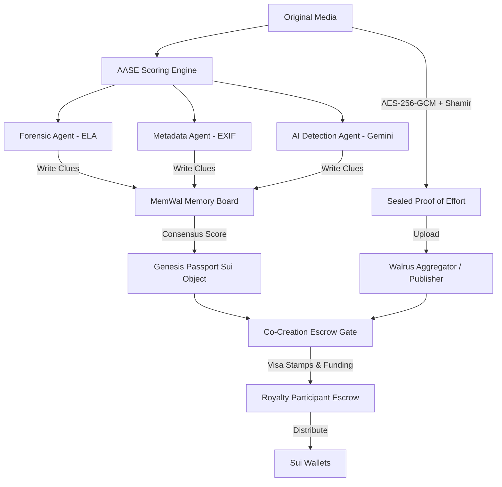

# 🌐 Content Passport

Content Passport is a persistent, verifiable memory graph and provenance layer for creative AI agents. It allows autonomous agents and human creators to prove content authenticity, seal proof-of-effort (PoE) artifacts, remember decisions across sessions, and coordinate royalty settlement through a portable state architecture built on **Sui** and **Walrus/MemWal**.

**Live Demo:** [https://contentright-three.vercel.app](https://contentright-three.vercel.app)

---

## 💡 Why Content Passport?

As AI agents increasingly collaborate to generate, remix, and distribute digital media, they lack a shared, trusted substrate to manage state, verify inputs, and coordinate value distribution. Content Passport solves this by introducing:

*   **Long-Term Memory:** Every agent decision, intermediate prompt clue, and co-creation step is written into a shared MemWal-style namespace and can be restored later.
*   **Persistent Artifact Storage:** High-res media, sealed evidence, audit reports, and memory graph snapshots are stored as Walrus blobs identified by globally verifiable Digests.
*   **Multi-Agent Coordination:** Forensic, metadata, AI detection, encryption, rights, and settlement agents pass inputs and outputs through the same unified memory graph.
*   **Artifact-Driven Workflows:** Downstream agents re-use prior Walrus artifacts instead of recomputing them, verifying the cryptographic lineage of each step.
*   **Decentralized Rights & Escrow:** Atomic revenue-sharing agreements are codified as Sui Move objects, allowing instant distribution of royalties.

---

## 🏗️ Architecture & Core Workflow

Content Passport orchestrates multi-agent assessment, secure evidence sealing, and Sui-based settlement. Here is how the system interacts:



### 1. Ingestion & Multi-Agent Auditing (AASE Engine)
An uploaded image is analyzed by the **Authenticity Assessment & Scoring Engine (AASE)**:
*   **Forensic Agent (`forensic-agent`):** Performs JPEG Error Level Analysis (ELA) via `sharp` recompression to detect manipulation.
*   **Metadata Agent (`metadata-agent`):** Checks EXIF structure, camera models, and GPS timestamps for consistency via `exifr`.
*   **AI Detection Agent (`ai-detection-agent`):** Queries Google Gemini models (when `GOOGLE_GENERATIVE_AI_API_KEY` is configured) or uses entropy heuristics.

### 2. MemWal Memory Board & Memory Graph
Individual clues, grades, and audit scores are published to a MemWal board namespace (`content-right-board`). Step-by-step agent coordination, input/output artifact IDs, and execution lineage are compiled into a JSON-serialized `ContentMemoryGraph` saved to Walrus.

### 3. Sealed Proof-of-Effort (PoE)
To protect confidential source files (like raw prompts, training parameters, or high-res layers), the asset is encrypted with AES-256-GCM. The decryption key is split into multiple shares using a Shamir Secret Sharing algorithm over GF(256) and signed with an Ed25519 session key. The encrypted bundle is uploaded to Walrus.

### 4. Sui Move Smart Contracts
Once verified, the engine interacts with the Sui Blockchain:
*   **Genesis Passport:** Issues a unique, non-custodial object containing content hashes, authenticity grades (AAA, AA, A), and Walrus blob links.
*   **Seal Policy:** Controls authorized access to encrypted data based on approval rules.
*   **Co-creation Escrow & Visa Stamps:** Tracks remix participants, registers creative consent, funds the budget escrow, and distributes royalties down to the dust integer.

---

## 📁 Repository Structure

```bash
├── contracts/               # Sui Move Smart Contracts
│   ├── Move.toml            # Move package config
│   └── sources/
│       ├── genesis_passport.move    # Issues Content Passports with AAA-C grades
│       ├── seal_policy.move         # AES key-sharing access controls
│       └── co_creation_policy.move  # Royalty escrow, stamps, and distribution
│
├── src/                     # Core TypeScript SDK (Backend & CLI Engine)
│   ├── aase.ts              # Assessment scoring and grade calculations
│   ├── agents.ts            # Forensic, EXIF, and AI detection agent scripts
│   ├── evidence.ts          # Shamir threshold key-sharing and AES-GCM encryption
│   ├── memory.ts            # MemWal memory client wrappers & namespace utilities
│   ├── sui.ts               # Transaction builders (Passport, Stamps, Escrow)
│   ├── walrus.ts            # Walrus publisher and aggregator HTTP client
│   └── workflow.ts          # Multi-agent Memory Graph compiler
│
├── web/                     # React + Vite Frontend Portal
│   ├── src/App.tsx          # Main Web Interface (Sovereign Vault, Inspector)
│   └── src/components/      # UI components (MemoryGraph, ConsentGate, Settlement)
│
└── scripts/
    └── memwal.ts            # Command-line utility for MemWal management
```

---

## 🛠️ Installation & Setup

### Prerequisites
*   Node.js (v18 or higher)
*   Sui CLI (for contract deployment and testing)

### Install Dependencies
```bash
npm install
cd web && npm install && cd ..
```

### Build & Run Tests
```bash
# Compile TypeScript files
npm run build

# Run unit tests (vitest)
npm test
```

### Run Console Demo
To simulate a multi-agent validation, passport issuance, co-creation escrow funding, and royalty settlement scenario locally:
```bash
npm run demo
```

---

## 🔌 Environment Configuration

Create a `.env` in the root folder or load these into your environment:

```env
# Sui Contract Deployment
CONTENT_RIGHT_PACKAGE_ID=0x...          # Sui package address after publishing
SUI_PRIVATE_KEY=suiprivkey1...          # Active gas-funded wallet private key

# Walrus & MemWal Storage
WALRUS_PUBLISHER=https://publisher.walrus-testnet.walrus.space
WALRUS_AGGREGATOR=https://aggregator.walrus-testnet.walrus.space
MEMWAL_SERVER_URL=https://relayer.memory.walrus.xyz
MEMWAL_ACCOUNT_ID=0x...
MEMWAL_PRIVATE_KEY=...
MEMWAL_NAMESPACE=content-passport-space

# Optional: AI Detection Agent
GOOGLE_GENERATIVE_AI_API_KEY=AIzaSy...   # Enables Gemini AI analysis
```

*Note: For local testing and development, the SDK automatically falls back to secure in-memory adapters if no external endpoints or keys are present.*

---

## 🖥️ Command Line (Walrus Memory CLI)

Manage and inspect your MemWal board namespaces directly from the CLI:

### 1. Initialize MemWal Credentials
If using the browser-based relayer authentication:
```bash
npm run memwal:login
```
Or generate and configure a delegate key manually:
```bash
npm run memwal:delegate
npm run memwal:create-account
npm run memwal:add-delegate
```
*(Save the generated delegate key inside `~/.memwal/credentials.json`)*

### 2. Verify Connection Health
```bash
npm run memwal:health
```

### 3. State Management
```bash
# Remember a value in the namespace
npm run memwal:remember -- "Content Passport verification successful."

# Query existing memory
npm run memwal:recall -- "verification successful"

# Restore full snapshot from Walrus
npm run memwal:restore
```

---

## 🌐 Running the Web Portal

To launch the web interface containing the **Authenticity Audit Dashboard**, **Sovereign Vault**, **MemWal Inspector**, and interactive **Memory Graph**:

```bash
cd web
npm run dev
```
Open your browser and navigate to `http://localhost:5173`.
