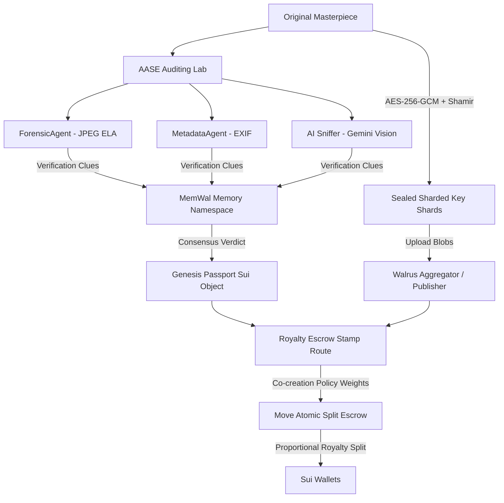
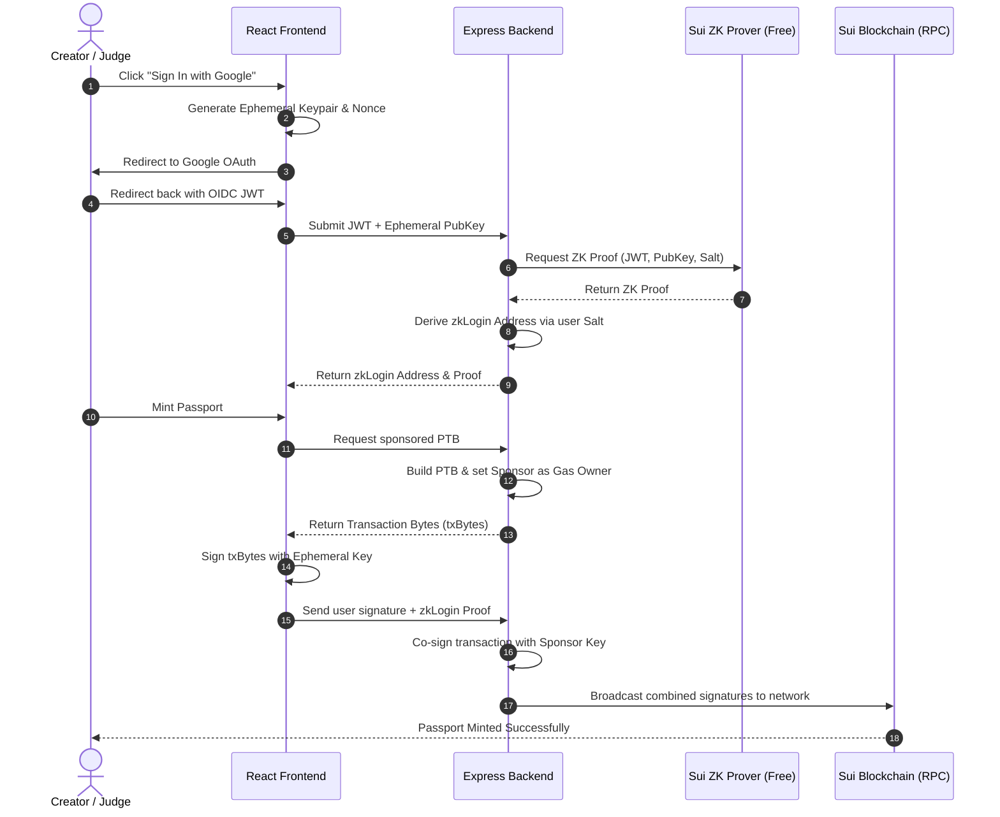
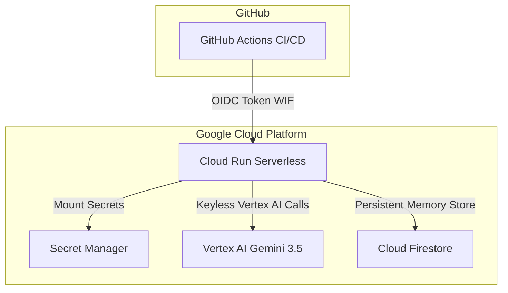

#  <span style="font-size: 1.4em; vertical-align: middle;">Content Passport</span>

Content Passport is an ultra-premium, verifiable decentralized border control and persistent memory ecosystem for creators and autonomous AI agents. Built on the **Sui blockchain** and **Walrus sharded blob storage**, it establishes on-chain identity, audits digital media authenticity, splits co-creation royalties, and secures raw evidence blobs using threshold cryptography.

The project is deployed and fully operational at **`https://content-passport.xyz/`**.

---

## ⚡ Core Pillars & Capabilities

The ecosystem is divided into four distinct cryptographic chambers:

### 1. 🎫 Identity Gate (Pure Web2.5 zkLogin)
*   **Zero-friction Social Onboarding:** General users authenticate via **Google Account (OIDC)**. No browser wallet extensions (like Sui Wallet) or pre-existing token balances are required.
*   **Decentralized Address Derivation:** Ephemeral session keys (ED25519) are generated in browser memory, bound to the user's Google JWT, and verified via Sui's public ZK Prover to derive a secure zkLogin address.
*   **Sponsored Transactions ($0.00 Gas Fee):** Transactions are built by the backend, signed locally by the user's ephemeral key, and co-signed by the backend Sponsor Wallet, which pays all gas fees.
*   **Sandbox Fallback:** Features a mock validation mode that simulates key derivation and transaction execution when RPC networks or sponsor secrets are unavailable.

### 2. 🔍 Authenticity Lab (AASE Checkpoint)
*   **Error Level Analysis (ELA):** Detect pixel manipulations by re-compressing uploaded images at 90% quality using `sharp` modules and measuring error metrics.
*   **EXIF Metadata Audit:** Read hardware profiles and sensor pattern timestamps via `exifr` parsers to check for capture-vs-modification consistency.
*   **AI Sniffer (Gemini & Vertex AI):** Pipelines forensic clues as context to Gemini cognitive visual models to audit synthetic lights, refractions, and neural net artifacts. Seamlessly supports Keyless Vertex AI in GCP production environments.
*   **Decentralized Memory Registry (MemWal):** Saves and queries forensic logs dynamically across Sui Testnet sharded memory blocks via the Walrus MemWal Relayer.

### 3. 🔐 Sealed Vault (SEAL Cryptography)
*   **Shamir Secret Sharing:** AES-256 symmetric keys encrypting raw drafts are sharded into 5 shares $(k=3, n=5)$ over GF(256) and stored across global guardians.
*   **Walrus Aggregator Blobs:** Sealed file packages are uploaded as secure, decentralized blobs locked under global digest registries.

### 4. 💰 Automated Royalties (Odyssey Ledger)
*   **Sui Move Smart Contract:** Declares creative weights on-chain using `co_creation_policy.move` registers.
*   **Atomic Royalty Splits:** Routes royalties directly into participants' wallets in a single transaction block when downstream remixed works are stamped.

---

## 🏗️ Technical Architecture & Protocol Workflow



### 3. Pure Web2.5 zkLogin & Sponsor Sequence


### 1. AASE Forensic Scoring Formula
Authenticity grades are computed dynamically by weighting individual forensic agents against standard deviation anomalies:

$$w_{\text{final}} = (0.35 \times C_{\text{forensic}}) + (0.30 \times C_{\text{metadata}}) + (0.25 \times C_{\text{ai}}) + (0.10 \times C_{\text{memory}})$$

If the standard deviation of noise distribution across segments exceeds threshold tolerances $(\sigma > 20)$, a strict synthetic penalty is applied:

$$Score_{\text{final}} = w_{\text{final}} - (\sigma - 20) \times 1.5$$

### 2. Shamir Key Reconstruction Protocol
A symmetric encryption key $S$ is hidden in a random polynomial $f(x)$ of degree $k-1$:

$$f(x) = S + a_1x + a_2x^2 + \dots + a_{k-1}x^{k-1} \pmod{p}$$

Any subset of $k$ nodes can aggregate their key shares $(x_i, y_i)$ to reconstruct the secret key $S$ via Lagrange Interpolation:

$$S = f(0) = \sum_{i=1}^{k} y_i \prod_{j \neq i} \frac{-x_j}{x_i - x_j} \pmod{p}$$

---

## 📁 Repository Directory Structure

*   [docs/](file:///Users/charles/Projects/content_passport/docs): Design systems, execution roadmaps, and business model papers
    *   [gcp_cicd_proposal.md](file:///Users/charles/Projects/content_passport/docs/gcp_cicd_proposal.md): **[Upgraded]** Detailed GCP architecture, CI/CD, and self-hosting proposal
    *   [architecture-and-deployment.md](file:///Users/charles/Projects/content_passport/docs/architecture-and-deployment.md): GCP Cloud Run deployment & API configurations
    *   [co-creation-business-model-ko.md](file:///Users/charles/Projects/content_passport/docs/co-creation-business-model-ko.md): Dynamic royalty splits & bounty quest specs
*   [contracts/](file:///Users/charles/Projects/content_passport/contracts): Sui Move Smart Contracts
    *   `Move.toml`: Package configuration
    *   `sources/genesis_passport.move`: Issues Content Passports with AAA-C grades
    *   `sources/seal_policy.move`: Shamir key-sharing access controls
    *   `sources/co_creation_policy.move`: Royalty escrow split and visa stamp registry
*   [src/](file:///Users/charles/Projects/content_passport/src): Core TypeScript SDK & Express Server
    *   [aase.ts](file:///Users/charles/Projects/content_passport/src/aase.ts): AASE grade formulas & scoring nodes
    *   [agents.ts](file:///Users/charles/Projects/content_passport/src/agents.ts): **[Upgraded]** Forensics, EXIF, and Gemini/Vertex AI Sniffer agents
    *   [evidence.ts](file:///Users/charles/Projects/content_passport/src/evidence.ts): Shamir threshold cryptography & AES envelope seal
    *   [memory.ts](file:///Users/charles/Projects/content_passport/src/memory.ts): **[Upgraded]** MemWal & GCP Firestore database memory clients
    *   [memwal.ts](file:///Users/charles/Projects/content_passport/src/memwal.ts): MemWal configuration parser & ED25519 flagged key handler
    *   [server.ts](file:///Users/charles/Projects/content_passport/src/server.ts): **[Upgraded]** Express server API endpoints & static Vite SPA server
    *   [sui.ts](file:///Users/charles/Projects/content_passport/src/sui.ts): Move contract transaction package builders
    *   [workflow.ts](file:///Users/charles/Projects/content_passport/src/workflow.ts): Multi-agent Memory Graph compiler
*   [web/](file:///Users/charles/Projects/content_passport/web): React + Vite Premium Frontend Portal
    *   [src/App.tsx](file:///Users/charles/Projects/content_passport/web/src/App.tsx): Main HUD shell, navigation routes & backdrop nebulae
    *   [src/styles.css](file:///Users/charles/Projects/content_passport/web/src/styles.css): Core design tokens, aurora glows & 3D card matrices
    *   `src/pages/`: Chamber UI Pages (Landing, Register, Verify, Vault, Blueprint, Chat)
*   [scripts/](file:///Users/charles/Projects/content_passport/scripts)
    *   [gcp_setup.ts](file:///Users/charles/Projects/content_passport/scripts/gcp_setup.ts): **[New]** GCP and GitHub setup automation tool
*   [tests/](file:///Users/charles/Projects/content_passport/tests)
    *   [memory.test.ts](file:///Users/charles/Projects/content_passport/tests/memory.test.ts): **[New]** Unit tests verifying Firestore and factory memory clients
    *   [agents.test.ts](file:///Users/charles/Projects/content_passport/tests/agents.test.ts): Forensic ELA, EXIF parser, and sniffer tests

---

## 🚢 Production Deployment Architecture (GCP Cloud Run)

The application is containerized and deployed as a **single-origin stateless container** on **Google Cloud Run**, serving both the API backend and static React SPA client on port `8080` (mapped to `https://content-passport.xyz/`).



*   **Multi-Stage Build Pipeline:** Compiled using Docker multi-stage builds and deployed via GitHub Actions [[.github/workflows/ci.yml](file:///Users/charles/Projects/content_passport/.github/workflows/ci.yml)].
*   **Keyless WIF Integration:** Employs Workload Identity Federation (WIF) OIDC credentials to authenticate pushes from GitHub to GCP keylessly.
*   **Vertex AI & Firestore Support:** In production, AI Forensics runs keylessly using GCP IAM Vertex AI configurations. Metadata and forensic logs are permanently indexed using Cloud Firestore database schemas.
*   **ED25519 Key Compatibility:** The backend contains a custom parser to translate Base64-encoded, 33-byte flagged key credentials (beginning with `00`) into raw 32-byte hex keys compatible with standard Sui SDKs.

---

## 🛠️ Installation & Execution Guide (Local Setup)

To set up the repository locally and run the test suite, follow these steps:

### 1. Prerequisites
*   Node.js (v20 or higher)
*   Sui CLI (for Move contract operations)
*   Google Cloud SDK & GitHub CLI (for GCP/CI/CD deployment setups)

### 2. Clone & Install Dependencies
Set up the root server SDK and the React web portal dependencies:
```bash
git clone https://github.com/CisThard/content_passport.git
cd content_passport
npm install
npm --prefix web ci
```

### 3. Configure Local Environment Variables
Create your local `.env` configuration file by copying the template file:
```bash
cp .env.example .env
```
Open `.env` and configure the required keys. (See [[.env.example](file:///Users/charles/Projects/content_passport/.env.example)] for detailed parameter guidelines).

#### 🛡️ Pure Web2.5 (Enoki-Free zkLogin & Sponsor) Setup:
To enable Google social login and gas-sponsored minting without subscribing to third-party SaaS (like Mysten Labs Enoki), configure the following variables in your `.env` file:
*   `AUTH_GOOGLE_ID`: Your Google Cloud Console OAuth 2.0 Client ID (Web Application type).
*   `AUTH_GOOGLE_SECRET`: Your Google Cloud Console OAuth 2.0 Client Secret.
*   `SUI_SPONSOR_SECRET_KEY` (or `SPONSOR_SECRET`): The 32-byte hex private key of the backend Sponsor Wallet. This wallet must be funded with SUI on the target network to pay transaction gas fees for users.

> [!IMPORTANT]
> **Google Cloud Console Redirect URIs Configuration:**  
> To prevent Google OAuth `redirect_uri_mismatch` errors, you **must** configure the **Authorized Redirect URIs** in your Google Cloud Console to match the application's client-side OIDC handlers. The callback URL must end in `/login-callback` (the old path `/api/auth/callback/google` is deprecated):
> *   **Production:** `https://content-passport.xyz/login-callback`
> *   **Local Dev:** `http://localhost:3000/login-callback`
*   `SUI_RPC_URL`: The Sui JSON-RPC node endpoint (defaults to `https://fullnode.testnet.sui.io:443`).

> [!TIP]
> **Mock Developer Sandbox Mode:**
> If `SUI_SPONSOR_SECRET_KEY` is left blank, the backend automatically operates in **Mock Sponsor Mode**. The system will simulate address derivation and sponsored execution, allowing developers to test the full E2E flow without configuring live Google OAuth keys or funding a sponsor wallet.

### 4. Build Verification & Compilation
Verify that the TypeScript server SDK and the Vite frontend compile without any type errors:
```bash
npm run build
npm --prefix web run build
```

### 5. Running the Test Suite
Ensure that the entire test suite (26 units covering escrow, forensics, memory, and blockchain contracts) runs and passes:
```bash
npm test
```

### 6. Run Server Locally (Port 3000)
To launch the Express server locally (which serves both the REST API and the static React client built inside `web/dist`):
```bash
npm run start
```
Open your browser and navigate to `http://localhost:3000`.

---

## ⚡ GCP & GitHub Auto-Configuration Setup (Proactive Deployment)

For team environments migrating to GCP, you can automatically provision and link all required cloud resources and repository credentials in a single click:

```bash
npx tsx --env-file=.env scripts/gcp_setup.ts
```

This automated setup script [[scripts/gcp_setup.ts](file:///Users/charles/Projects/content_passport/scripts/gcp_setup.ts)] will:
1. **Enable GCP APIs**: Activate Artifact Registry, Cloud Run, Secret Manager, Vertex AI, and IAM services.
2. **Provision Registries**: Create the Docker storage repo `content-passport-repo`.
3. **Configure WIF & Service Accounts**: Create service accounts and bind secure OpenID Connect permissions allowing keyless deployments from your GitHub Actions runner.
4. **Synchronize Secrets**: Safely upload local `.env` secrets directly into GCP Secret Manager.
5. **Set GitHub Repository Secrets**: Register the WIF provider URLs and project IDs into GitHub secrets using `gh` CLI commands.
