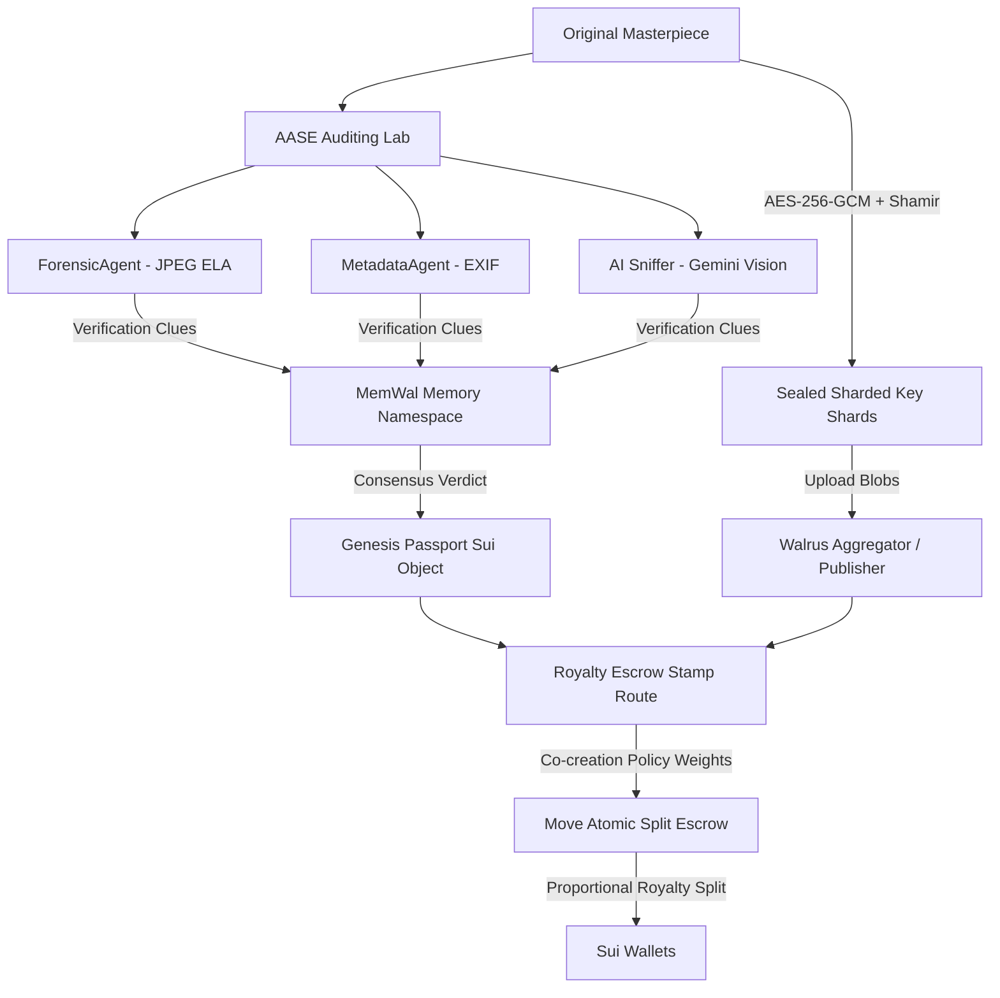

#  <span style="font-size: 1.4em; vertical-align: middle;">Content Passport</span>

Content Passport is an ultra-premium, verifiable decentralized border control and persistent memory ecosystem for creators and autonomous AI agents. Built on the **Sui blockchain** and **Walrus sharded blob storage**, it establishes on-chain identity, audits digital media authenticity, splits co-creation royalties, and secures raw evidence blobs using threshold cryptography.

The project is deployed and fully operational at **`https://content-passport.xyz/`**.

---

## ⚡ Core Pillars & Capabilities

The ecosystem is divided into four distinct cryptographic chambers:

### 1. 🎫 Platform 9 ¾ Chamber (On-chain Identity)
*   **Sovereign Namespaces:** Claim unique subdomains via SuiNS (Sui Name Service) directly written into Move identity objects.
*   **Sponsored Session Keys:** Generate local, ephemeral Ed25519 SessionKeys with 10-minute TTLs, enabling gasless, pop-up-free sponsored transaction block (PTB) pipelines.

### 2. 🦁 Aurelius Forensic Lab (AASE Checkpoint)
*   **Error Level Analysis (ELA):** Detect pixel manipulations by re-compressing uploaded images at 90% quality using `sharp` modules and measuring error metrics.
*   **EXIF Metadata Audit:** Read hardware profiles and sensor pattern timestamps via `exifr` parsers to check for capture-vs-modification consistency.
*   **AI Sniffer (Gemini 3.5 Flash):** Pipeline forensic clues as context to Gemini cognitive visual models to audit synthetic lights, refractions, and neural net artifacts.
*   **Decentralized Memory Registry (MemWal):** Save and query forensic logs dynamically across Sui Testnet sharded memory blocks via the Walrus MemWal Relayer.

### 3. 🔐 Sharded Secret Vault (SEAL Cryptography)
*   **Shamir Secret Sharing:** AES-256 symmetric keys encrypting raw drafts are sharded into 5 shares $(k=3, n=5)$ over GF(256) and stored across global guardians.
*   **Walrus Aggregator Blobs:** Sealed file packages are uploaded as secure, decentralized blobs locked under global digest registries.

### 4. 🚂 Escrow Stamp Junction (Odyssey Ledger)
*   **Sui Move Smart Contract:** Declares creative weights on-chain using `co_creation_policy.move` registers.
*   **Atomic Royalty Splits:** Routes royalties directly into participants' wallets in a single transaction block when downstream remixed works are stamped.

---

## 🏗️ Technical Architecture & Protocol Workflow



### 1. AASE Forensic Scoring Formula
Authenticity grades are computed dynamically by weighting individual forensic agents against standard deviation anomalies:

$$w_{\text{final}} = (0.35 \times C_{\text{forensic}}) + (0.30 \times C_{\text{metadata}}) + (0.25 \times C_{\text{ai}}) + (0.10 \times C_{\text{memory}})$$

If the standard deviation of noise distribution across segments exceeds threshold tolerances $(\sigma > 20)$, a strict synthetic penalty is applied:

$$Score_{\text{final}} = w_{\text{final}} - (\sigma - 20) \times 1.5$$

### 2. Shamir Key Reconstruction Protocol
A symmetric encryption key $S$ is hidden in a random polynomial $f(x)$ of degree $k-1$:

$$f(x) = S + a_1x + a_2x^2 + \dots + a_{k-1}x^{k-1} \pmod{p}$$

Any subset of $k$ nodes can aggregate their key shares $(x_i, y_i)$ to reconstruct the secret key $S$ via Lagrange Interpolation:

$$S = f(0) = \sum_{i=1}^{k} y_i \prod_{j \neq i} \frac{-x_j}{x_i - x_j} \pmod{p}$$

---

## 📁 Repository Directory Structure

```bash
├── docs/                    # Design systems, execution roadmaps, and business model papers
│   ├── co-creation-business-model.md  # Dynamic royalty splits & bounty quest specs
│   ├── frontend-upgrade-report.md      # Cybernetic dark-neon theme redesign logs
│   └── architecture-and-deployment.md  # GCP Cloud Run deployment & API configurations
│
├── contracts/               # Sui Move Smart Contracts
│   ├── Move.toml            # Package configuration
│   └── sources/
│       ├── genesis_passport.move    # Issues Content Passports with AAA-C grades
│       ├── seal_policy.move         # Shamir key-sharing access controls
│       └── co_creation_policy.move  # Royalty escrow split and visa stamp registry
│
├── src/                     # Core TypeScript SDK & Express Server
│   ├── aase.ts              # AASE grade formulas & scoring nodes
│   ├── agents.ts            # Forensic, EXIF, and AI detection agent scripts
│   ├── evidence.ts          # Shamir threshold cryptography & AES envelope seal
│   ├── memory.ts            # MemWal namespace storage client wrappers
│   ├── memwal.ts            # MemWal configuration parser & ED25519 flagged key handler
│   ├── server.ts            # Express server API endpoints & static SPA server
│   ├── sui.ts               # Move contract transaction package builders
│   └── workflow.ts          # Multi-agent Memory Graph compiler
│
├── web/                     # React + Vite Premium Frontend Portal
│   ├── src/App.tsx          # Main HUD shell, navigation routes & backdrop nebulae
│   ├── src/styles.css       # Core design tokens, aurora glows & 3D card matrices
│   ├── src/samples.ts       # Test specimens for DSLR raw & SD generated data
│   └── src/pages/           # Chamber UI Modules
│       ├── Landing.tsx      # Unified cockpit dashboard & Basecamp metrics
│       ├── Register.tsx     # Session key log console & holographic passport
│       ├── Verify.tsx       # Real-time forensic scanner, file uploads & MemWal clues feed
│       ├── Vault.tsx        # File drag-and-drop dropzone & key shards orbit
│       ├── Blueprint.tsx    # Interactive co-creation economy blueprint & simulator
│       └── Chat.tsx         # AI K-9 Sniffer assistant chatbot terminal
│
└── scripts/
    └── memwal.ts            # CLI utility for command-line MemWal operations
```

---

## 🚢 Production Deployment Architecture (GCP Cloud Run)

The application is containerized and deployed as a **single-origin stateless container** on **Google Cloud Run**, serving both the API backend and static React SPA client on port `8080` (mapped to `https://content-passport.xyz/`).

* **Multi-Stage Build Pipeline:** Compiled using GCP Cloud Build. The builder stage installs all dependencies, runs Vite production packaging, and outputs static assets to `web/dist`, which the Express runtime serves statically.
* **GCP Secret Manager Integration:** Key secrets such as `SUI_PRIVATE_KEY` and `MEMWAL_PRIVATE_KEY` are mounted directly into container environment variables on startup.
* **ED25519 Key Compatibility:** The backend contains a custom parser to translate Base64-encoded, 33-byte flagged key credentials (beginning with `00`) into raw 32-byte hex keys compatible with standard Sui SDKs.

---

## 🛠️ Installation & Execution Guide

### Prerequisites
*   Node.js (v20 or higher)
*   Sui CLI (for on-chain package deployment)

### Install Dependencies
Set up the backend SDK and the Web portal dependencies:
```bash
npm install
npm --prefix web install
```

### Build Verification & Compilation
Confirm the TypeScript SDK and the Web portal compile without any linter or type errors:
```bash
npm run build
npm --prefix web run build
```

### Run Server Locally (Port 3000)
To launch the Express server locally (which serves both the REST API and the static React client built inside `web/dist`):
```bash
npm run start
```
Open your browser and navigate to `http://localhost:3000`.

---

## 🔌 Environment Parameters

Configure a `.env` file in the project root directory or supply these in your shell environment (see `.env.example` for details):

```env
# Authentication (Auth.js)
AUTH_GOOGLE_ID="your-google-client-id.apps.googleusercontent.com"
AUTH_GOOGLE_SECRET="GOCSPX-your-google-client-secret"
AUTH_SECRET="your-nextauth-session-secret-key"
AUTH_URL="http://localhost:3000"

# Sui Smart Contracts
CONTENT_RIGHT_PACKAGE_ID=0xac28432a557d52d7079930a82a5c1732a3709da3c6cb2991ce0332b0704061da
SUI_PRIVATE_KEY=suiprivkey1...
SUI_NETWORK=testnet

# Walrus & MemWal Relayers
WALRUS_PUBLISHER=https://publisher.walrus-testnet.walrus.space
WALRUS_AGGREGATOR=https://aggregator.walrus-testnet.walrus.space
MEMWAL_SERVER_URL=https://relayer.memory.walrus.xyz
MEMWAL_ACCOUNT_ID=0x...
MEMWAL_PRIVATE_KEY=...
MEMWAL_NAMESPACE=content-right-hackathon

# AI Verification
GOOGLE_GENERATIVE_AI_API_KEY=AIzaSy...   # Gemini Vision API key
```
