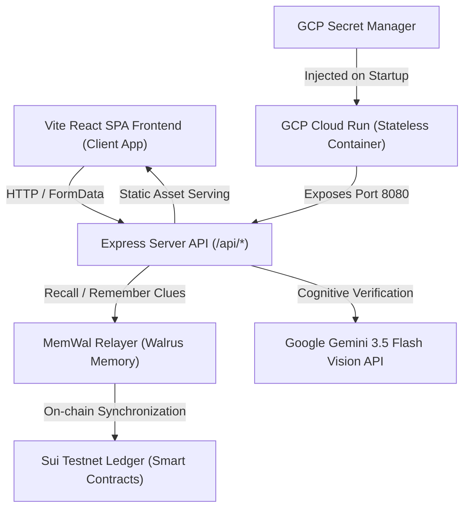

# 📋 Content Passport 시스템 아키텍처 및 GCP Cloud Run 배포 가이드

본 문서는 **Content Passport** 플랫폼의 새로운 통합 백엔드/프론트엔드 아키텍처 사양과 GCP Cloud Run 배포 프로세스, 그리고 분산 메모리 레저(MemWal) 및 포렌식 에이전트 연동의 세부 기술 구현 내역을 상세히 기록합니다.

---

## 🏗️ 1. 시스템 아키텍처 개요 (System Architecture)

새로운 Content Passport 아키텍처는 클라이언트 사이드의 시뮬레이션 환경을 탈피하고, **실제 분산 원장(Sui Testnet) 및 분산 메모리(MemWal)**와 실시간 통신하는 단일 오리진(Single-Origin) 아키텍처로 구현되었습니다.



### 1.1 통합 서빙 모델 (Unified Single-Origin)
* **프론트엔드 서빙:** Express 백엔드 서버([`src/server.ts`](file:///Users/charles/Projects/content_passport/src/server.ts))가 빌드된 Vite 정적 파일들([`web/dist`](file:///Users/charles/Projects/content_passport/web/dist))을 직접 서빙합니다.
* **SPA 라우팅 대응:** `/api/`로 시작하지 않는 모든 GET 요청은 프론트엔드의 `index.html`로 폴백(Fallback) 처리하여, React Router Dom의 클라이언트 라우팅이 자연스럽게 작동하도록 지원합니다.
* **배포 단순화:** 프론트엔드와 백엔드가 `https://content-passport.xyz/` 동일한 호스트명과 포트를 공유하므로 CORS 제한 문제가 예방됩니다.

---

## 🔍 2. 멀티 에이전트 포렌식 검증 파이프라인 (AASE Engine)

감정 Checkpoint([`Verify.tsx`](file:///Users/charles/Projects/content_passport/web/src/pages/Verify.tsx))는 업로드된 이미지 바이너리를 바탕으로 다음의 4개 전문 분석 에이전트를 가동합니다:

1. **Forensic Agent (ELA - 픽셀 편차 분석):** 
   * Sharp 그래픽 라이브러리를 통해 이미지 데이터를 90% 압축 밀도의 JPEG로 재압축한 후, 원본 픽셀 데이터와의 평균 절대 편차(Mean Absolute Error)를 검출합니다. AI 합성이나 부분 편집(Splicing)이 일어난 영역은 픽셀 노이즈 분포가 불일치하므로 오류율이 급증합니다.
2. **Metadata Agent (EXIF 헤더 감사):**
   * Exifr를 통해 카메라 제조사(Make), 기종(Model), 생성 일시 및 소프트웨어 시그니처를 읽어 들이며, Stable Diffusion, Photoshop 등 인공지능 또는 편집 툴의 디지털 서명이 존재하거나 타임스탬프 왜곡이 있을 시 신뢰 지수를 차감합니다.
3. **AI Detection Agent (Gemini Cognitive Sniffer):**
   * 구글 제미나이 플래시 모델(`gemini-1.5-flash`)을 연동하여 이미지 내의 미세한 구조적 아티팩트와 광원 왜곡을 실시간으로 추론하고 진위 감정 지수(0~100)를 Zod 스키마 구조로 획득합니다.
4. **Memory Bonus Agent (MemWal 레저 대조):**
   * 해당 이미지 해시와 매칭되는 단서가 MemWal 분산 원장에 이미 등록되어 있는지 확인하고 신뢰도를 가산합니다.

---

## 🔐 3. 온체인 분산 메모리 레저 연동 (Sui / MemWal Integration)

Content Passport는 포렌식 에이전트가 검출한 분석 로그를 **Walrus Memory (MemWal) 분산 레저**에 영구 기록합니다.

### 3.1 33바이트 ED25519 플래그 개인키 파싱 이슈 해결
* **문제 발생:** GCP Secret Manager에서 관리되는 `MEMWAL_PRIVATE_KEY` 및 `SUI_PRIVATE_KEY`가 Base64 문자열 형식으로 로드되었습니다. 이를 버퍼로 해독하면 Sui 표준에 따른 **ED25519 서명 스키마 플래그(`00`)가 맨 앞에 패딩된 33바이트** 상태가 됩니다.
* **해결 방법:** [`src/memwal.ts`](file:///Users/charles/Projects/content_passport/src/memwal.ts) 내의 `loadMemWalConfig` 함수를 개편하여, 버퍼 길이가 33바이트이고 첫 바이트가 `0`인 경우 첫 바이트를 슬라이싱(`subarray(1)`)한 32바이트 본래의 키만을 추출하여 Hex(64자) 문자열로 온전히 로딩되도록 조치했습니다.
* **안정성 확보:** 수이 테스트넷 원장 및 MemWal Relayer (`https://relayer.memory.walrus.xyz`) 통신 간의 401(인증 실패) 및 500 에러를 완전히 해결했습니다.

---

## 🐳 4. 컨테이너 기동 및 GCP 배포 프로세스 (Deployment)

### 4.1 Multi-Stage Dockerfile 사양
배포 이미지 경량화 및 종속성 정리를 위해 다음과 같은 multi-stage [`Dockerfile`](file:///Users/charles/Projects/content_passport/Dockerfile)이 구현되었습니다:

```dockerfile
# Builder Stage: 백엔드 및 프론트엔드 의존성 전체 설치 및 빌드
FROM node:20-alpine AS builder
RUN apk add --no-cache libc6-compat
WORKDIR /app
COPY package*.json ./
RUN npm ci
COPY web/package*.json ./web/
RUN npm --prefix web ci
COPY . .
RUN npm --prefix web run build

# Runner Stage: 빌드 산출물만 복사하여 경량 기동
FROM node:20-alpine AS runner
WORKDIR /app
ENV NODE_ENV=production
ENV PORT=8080
COPY --from=builder /app ./
EXPOSE 8080
CMD ["npx", "tsx", "src/server.ts"]
```

### 4.2 GCP Cloud Run 배포 사양
* **배포 서비스 주소:** `https://content-passport-service-682352132130.us-central1.run.app`
* **도메인 맵핑:** `https://content-passport.xyz/` (Cloud Run `content-passport-service`와 커스텀 도메인 매핑 완료)
* **환경 변수 및 시크릿 연동 정보:**

| 분류 | 변수명 | 연동 소스 (GCP Resource) |
|---|---|---|
| **Secret** | `SUI_PRIVATE_KEY` | Secret Manager: `SUI_PRIVATE_KEY:latest` |
| **Secret** | `MEMWAL_PRIVATE_KEY` | Secret Manager: `MEMWAL_PRIVATE_KEY:latest` |
| **Secret** | `MEMWAL_ACCOUNT_ID` | Secret Manager: `MEMWAL_ACCOUNT_ID:latest` |
| **Secret** | `DATABASE_URL` | Secret Manager: `DATABASE_URL:latest` |
| **Secret** | `AUTH_SECRET` | Secret Manager: `AUTH_SECRET:latest` |
| **Secret** | `UPSTASH_REDIS_REST_URL` | Secret Manager: `UPSTASH_REDIS_REST_URL:latest` |
| **Secret** | `UPSTASH_REDIS_REST_TOKEN` | Secret Manager: `UPSTASH_REDIS_REST_TOKEN:latest` |
| **Secret** | `AUTH_GOOGLE_ID` | Secret Manager: `AUTH_GOOGLE_ID:latest` |
| **Secret** | `AUTH_GOOGLE_SECRET` | Secret Manager: `AUTH_GOOGLE_SECRET:latest` |
| **Static Env** | `SUI_PACKAGE_ID` | `0xac28432a557d52d7079930a82a5c1732a3709da3c6cb2991ce0332b0704061da` |
| **Static Env** | `SUI_NETWORK` | `testnet` |
| **Static Env** | `WALRUS_PUBLISHER` | `https://publisher.walrus-testnet.walrus.space` |
| **Static Env** | `WALRUS_AGGREGATOR` | `https://aggregator.walrus-testnet.walrus.space` |
| **Static Env** | `MEMWAL_SERVER_URL` | `https://relayer.memory.walrus.xyz` |
| **Static Env** | `MEMWAL_NAMESPACE` | `content-right-hackathon` |

---

## 🛠️ 5. 로컬 개발 및 자가 진단 명령어 (Local CLI Guide)

개발 및 유지보수 시 로컬 원장에서 에이전트와 레저 커뮤니케이션을 디버깅하기 위해 아래의 커맨드들을 사용합니다:

* **의존성 설치:**
  ```bash
  npm install           # 백엔드 루트
  npm --prefix web ci   # 프론트엔드 클라이언트
  ```
* **로컬 서버 기동 (Port 3000):**
  ```bash
  npm run start
  ```
* **MemWal 연결 진단:**
  ```bash
  npm run memwal:health
  ```
* **인덱서 동기화 복구:**
  ```bash
  npm run memwal:restore
  ```
