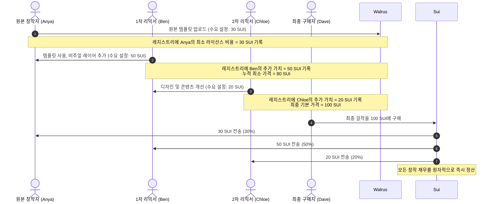
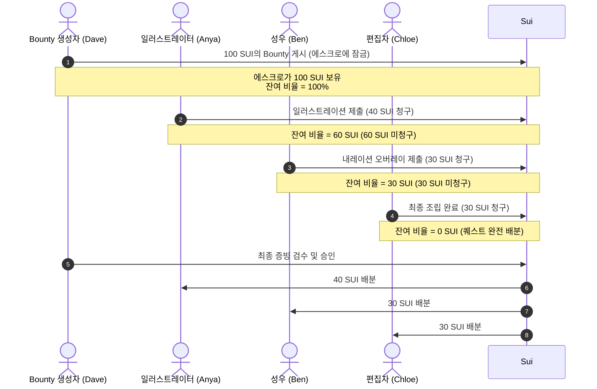

# 🚂 Content Passport 공동 창작 비즈니스 모델 및 기술 매핑

이 문서는 Content Passport의 정교화된 **공동 창작 로열티 공유 비즈니스 모델**을 상세히 기술합니다. 추상적인 퍼센트 분배(예: "A 60%, B 30%, C 10%") 대신, 구체적이고 트랜잭션 지향적인 금융 워크플로우를 통해 협업을 재정의합니다: **공급자 유형 유료 리믹스 체인**과 **수요자 유형 Bounty 퀘스트**입니다.

---

## 💡 추상적 퍼센트의 문제점
전통적인 로열티 네트워크는 창작자들이 공백 상태에서 추상적인 퍼센트 비율(예: $60/30/10$)을 사전에 협상하도록 요구합니다. 이는 비즈니스적으로 결점이 있습니다:
1. **절대 가치 기준 부재:** 알 수 없는 미래 매출의 60%는 창작 노동에 대한 예산 계획이 불가능합니다.
2. **무한 협상 루프:** 상대적 퍼센트 설정은 마찰을 초래합니다. 창작자들은 각자의 기여도에 대한 상대적 가치를 논쟁해야 합니다.
3. **구매자 상호작용 부재:** 최종 제품의 가치를 구매자의 실제 지불 의사와 일치시키지 못합니다.

---

## 🎨 정교화된 비즈니스 워크플로우

### 1. 공급자 유형 흐름: 유료 리믹스 체인 (순방향 체인)
이 모델에서 창작자들은 기여도에 대해 **고정되고 협상 불가능한 최소 라이선스 비용**을 설정합니다. 에셋의 가치는 리믹스될 때 동적으로 집계됩니다.

#### 단계별 시나리오
1. **원본 창작자 (Anya):** "저는 제 핵심 사진 에셋을 라이선스합니다. 누구든 리믹스할 수 있지만, 최종 판매 시 최소 **30 SUI**를 받아야 합니다."
2. **1차 리믹서 (Ben):** "저는 Anya의 템플릿을 사용하여 합성 이미지를 만들고 있습니다. 제 디자인과 구성 작업은 최소 **50 SUI**의 가치가 있습니다."
3. **2차 리믹서 (Chloe):** "저는 Ben의 작업에 전문적인 색상 보정과 타이포그래피를 추가했습니다. 제 기여에 대해 **20 SUI**를 요청합니다."
4. **누적 기본 가격:** 시스템이 요구사항을 합산합니다 ($30 + 50 + 20 = 100$ SUI).
5. **구매자 (Dave):** "이 최종 아트워크는 환상적입니다. **100 SUI**에 구매하겠습니다."
6. **지급:** 스마트 컨트랙트가 Dave의 결제를 수락하고 펀드를 원자적으로 라우팅합니다: **Anya에게 30 SUI**, **Ben에게 50 SUI**, **Chloe에게 20 SUI**.

---

### 2. 수요자 유형 흐름: 공동 창작 퀘스트 (역방향 체인)
이 모델에서 구매자는 특정 매개변수와 일치하는 콘텐츠에 대해 **고정된 총 bounty**를 설정합니다. 창작자들은 기준을 충족하기 위해 모듈적으로 협업하고, bounty의 일부를 청구합니다.

#### 단계별 시나리오
1. **Bounty 소유자 (Dave):** "제품 마케팅 영상이 필요합니다. **100 SUI**의 bounty를 에스크로에 잠급니다."
2. **일러스트레이터 (Anya):** "스토리보드와 캐릭터를 그겠습니다. bounty에서 **40 SUI**를 청구합니다."
3. **성우 (Ben):** "내레이션 대본을 녹음하겠습니다. bounty에서 **30 SUI**를 청구합니다."
4. **비디오 편집자 (Chloe):** "Anya의 아트와 Ben의 목소리를 모션 그래픽으로 동기화하겠습니다. 잔여 **30 SUI**를 청구합니다."
5. **배분 완료:** 잔여 비율이 0에 도달합니다. Dave는 Content Passport에서 검증된 최종 결과물을 검수합니다.
6. **승인 및 지급:** Dave가 작업을 승인합니다. 에스크로된 **100 SUI**가 즉시 분할됩니다: **Anya에게 40 SUI**, **Ben에게 30 SUI**, **Chloe에게 30 SUI**.

---

## 🛠️ 기존 기술 스택과의 매핑

Content Passport를 위해 구축된 스마트 컨트랙트, 암호화 스위트, 포렌식 엔진은 이러한 비즈니스 모델에 직접 매핑됩니다.

| 기술 구성요소 | 공급자 유형 리믹스 체인 역할 | 수요자 유형 Bounty 퀘스트 역할 |
| :--- | :--- | :--- |
| **🎫 SuiNS (자율 네임스페이스)** | 리믹스 계보를 식별합니다. 예: `anya.sui` $\rightarrow$ `ben.anya.sui` $\rightarrow$ `chloe.ben.anya.sui`. | 협력자 프로필과 포트폴리오를 활성 퀘스트 제출에 매핑합니다. |
| **⚡ 스폰서 세션 키** | 중간 업데이트를 위한 지갑 팝업 없이 원활한 가스 없는 "리믹스 스탬프"를 가능하게 합니다. | 작업에 대한 빠른 마이크로 청구를 허용합니다 (예: 서명 트랜잭션 팝업 없이 하위 작업 청구). |
| **🦁 AASE 포렌식 라보레토리 (ELA/EXIF/Gemini)** | 수정된 에셋을 감사합니다. 리믹서가 중복 파일이 아닌 진정한 창작 레이어를 추가했는지 확인합니다. | 제출물이 bounty 소유자가 설정한 형식, 품질, 콘텐츠 규칙을 충족하는지 검증합니다. |
| **🔐 샤드 보안 볼트 (SEAL/Walrus)** | 고해상도 리믹스 파일을 암호화된 상태로 유지합니다. 핵심 노드만 샤드를 보유합니다. 구매자는 구매 시 복호화된 파일을 잠금 해제합니다. | 작업 중인 초안을 보호합니다. 에스크로 해제 전에 bounty 소유자가 콘텐츠를 탈취하는 것으로부터 창작자를 보호합니다. |
| **🚂 에스크로 스탬프 교차점 (`co_creation_policy.move`)** | 누적 청구를 기반으로 퍼센트 가중치를 동적으로 계산합니다: $W_i = (P_i / \sum P) \times 100$. 온체인 비율을 잠급니다. | `escrow_balance`에 총 bounty 금액을 보유합니다. `remaining_share`가 0이고 해제가 승인될 때까지 지급을 잠급니다. |

### 온체인 컨트랙트 통합
Move 컨트랙트 `co_creation_policy.move`는 이러한 모델을 실행하는 데 필요한 모든 함수를 포함합니다:
* **순방향 체인 초기화:** `create_stamp_book(passport_id, origin_creator, origin_weight)`를 사용하며, 여기서 `origin_weight`는 초기 총액 대비 초기 템플릿 가격의 퍼센트 비율입니다.
* **순방향 체인 확장:** 리믹서가 콘텐츠를 추가할 때, `stamp_visa(policy, creator, weight)`는 리믹서의 비례적 비율을 등록합니다.
* **역방향 체인 에스크로:** `create_and_fund_policy`를 사용하여 정책 객체를 생성하고 구매자의 결제를 `escrow_balance`에 단일 트랜잭션으로 잠급니다.
* **역방향 체인 청구:** 협력자가 `stamp_visa`를 호출하여 자신의 주소를 등록하고 퍼센트 슬라이스(`weight`)를 청구하며, 컨트랙트의 `remaining_share`를 감소시킵니다.
* **정산:** 최종 기준이 충족되면, `distribute_royalties`를 호출하여 에스크로된 펀드를 모든 기록된 주소에게 원자적이고 안전하게 분할합니다.

---

## 🖥️ UI 통합 및 애플리케이션 시스템

이 비즈니스 지향적 모델을 Web 포털(`web/src/pages/Remix.tsx`)에 적용하기 위해, 단순한 정적 퍼센트 슬라이더에서 동적 듀얼 모드 대시보드로 페이지 레이아웃을 재구성합니다.

### 1. 듀얼 모드 선택기
**리믹스 스탬프 교차점** 페이지 상단에서 사용자는 다음 사이를 토글할 수 있습니다:
*   **[모드 A] 유료 리믹스 체인** (공급자 유형)
*   **[모드 B] 공동 창작 퀘스트** (수요자 유형 Bounty)

---

### 2. UI 레이아웃 및 컴포넌트 설계

#### 모드 A: 유료 리믹스 체인 콕핏
이 레이아웃은 창작자들이 라이선스 요구사항을 시각적으로 체인화할 수 있게 합니다.

*   **인터랙티브 입력 양식:**
    *   *SuiNS 도메인 입력:* 귀하의 자율 ID를 입력합니다 (예: `ben.sui`).
    *   *에셋 템플릿 선택기:* Walrus 스토리지에 저장된 상위 템플릿에서 선택합니다 (AASE 검증을 통해).
    *   *내 라이선스 비용 (SUI):* 퍼센트 대신 숫자 값을 입력합니다 (예: `50 SUI`).
*   **리믹스 계보 타임라인:**
    에셋의 진행 상황을 보여주는 가로 타임라인:
    $$\text{Anya (원본: 30 SUI)} \xrightarrow{\text{스탬프}} \text{Ben (리믹스 1: +50 SUI)} \xrightarrow{\text{스탬프}} \text{Chloe (리믹스 2: +20 SUI)}$$
*   **가격 요약 패널:**
    *   *기본 비용 (누적):* `100 SUI`
    *   *계산된 비율:* Anya (30%), Ben (50%), Chloe (20%).
    *   *실행 버튼:* `[리믹스 스탬프 & Walrus에 게시]` — **세션키**로 트랜잭션에 서명하고, Move 정책 가중치를 업데이트하며, 샤드 보안 볼트에서 초안을 재암호화합니다.

#### 모드 B: 공동 창작 퀘스트 허브
이 레이아웃은 bounty 생성과 협업적 청구를 촉진합니다.

*   **Bounty 생성자 패널:**
    *   *Bounty 제목:* "3D 공상과학 캐릭터 애니메이션 제작"
    *   *Bounty 풀:* `150 SUI` (`create_and_fund_policy`를 통해 예치).
    *   *퀘스트 상태:* `청구 가능`
*   **협업 청구 장부:**
    청구된 슬롯 목록을 표시합니다:
    *   슬롯 1: 캐릭터 모델 (`anya.sui`가 **60 SUI** 청구 - 40% 가중치) $\rightarrow$ `[상태: AASE에 의해 검증됨]`
    *   슬롯 2: 텍스처 및 셰이더 (`ben.sui`가 **45 SUI** 청구 - 30% 가중치) $\rightarrow$ `[상태: AASE에 의해 검증됨]`
    *   슬롯 3: 리깅 및 애니메이션 (`chloe.sui`가 **45 SUI** 청구 - 30% 가중치) $\rightarrow$ `[상태: 청구됨 - 파일 대기 중]`
*   **배분 진행 추적기:**
    *   에스크로 분할 배분을 나타내는 발광 프로그레스 바:
        $$\text{에스크로 배분: 150 SUI / 150 SUI (100\%)}$$
    *   *잔여 비율:* `0 SUI (퀘스트 잠김)`
*   **Bounty 소유자 콕핏:**
    *   *제출물 검증:* **아우렐리우스 포렌식 라보레토리**와 통합하여 파일 제출물에 대한 진위 점수 검사를 실행합니다.
    *   *실행 버튼:* `[Bounty 에스크로 해제]` — `distribute_royalties`를 실행하여 즉시 지급을 트리거합니다.
