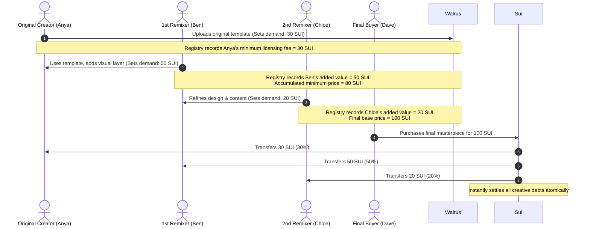
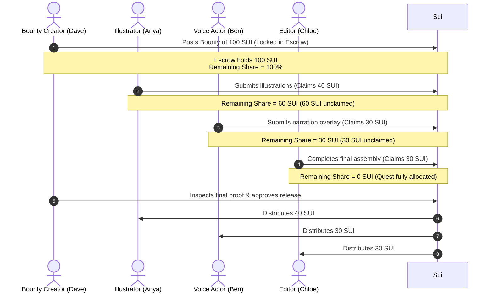

# 🚂 Content Passport Co-Creation Business Model & Technical Mapping

This document details the refined **Co-creation Royalty Sharing Business Model** for Content Passport. Instead of abstract percentage splits (e.g., "A gets 60%, B gets 30%, C gets 10%"), we redefine collaboration through concrete, transaction-oriented financial workflows: **Supply-Side Paid Remix Chains** and **Demand-Side Bounty Quests**.

---

## 💡 The Problem with Abstract Percentages
Traditional royalty networks require creators to pre-negotiate abstract percentage shares (e.g., $60/30/10$) in a vacuum. This is business-deficient because:
1. **No absolute value baseline:** A 60% share of an unknown future sale is impossible to budget against for creative labor.
2. **Infinite negotiation loops:** Setting relative percentages invites friction, as creators must debate the relative value of their inputs.
3. **No buyer interaction:** It fails to align the final product's value with the buyer's actual willingness to pay.

---

## 🎨 Refined Business Workflows

### 1. Supply-Side Flow: Paid Remix Chain (Forward Chain) — `[Status: Active / Implemented]`
In this model, creators set **fixed, non-negotiable minimum licensing fees** for their contributions. The value of the asset aggregates dynamically as it is remixed.

#### Step-by-Step Scenario
1. **Original Creator (Anya):** "I will license my core photographic asset. Anyone can remix it, provided I receive at least **30 SUI** upon final sale."
2. **1st Remixer (Ben):** "I am building a composite image using Anya's template. My design and composition work is worth at least **50 SUI**."
3. **2nd Remixer (Chloe):** "I've added professional color correction and typography to Ben's work. I request **20 SUI** for my input."
4. **Accumulated Base Price:** The system sums the requirements ($30 + 50 + 20 = 100$ SUI).
5. **Buyer (Dave):** "This final artwork looks spectacular. I am willing to buy it for **100 SUI**."
6. **Payout:** The smart contract accepts Dave's payment and routes the funds atomically: **30 SUI to Anya**, **50 SUI to Ben**, and **20 SUI to Chloe**.

---

### 2. Demand-Side Flow: Co-Creation Quest (Reverse Chain) — `[Status: Planned / Under Development]`
In this model, a buyer sets a **fixed total bounty** for content matching specific parameters. Creators collaborate modularly to fulfill the criteria, claiming chunks of the bounty.

#### Step-by-Step Scenario
1. **Bounty Owner (Dave):** "I need a marketing video for my product. I am locking a **100 SUI** bounty in escrow."
2. **Illustrator (Anya):** "I will draw the storyboard and storyboard characters. I claim **40 SUI** from the bounty."
3. **Voice Actor (Ben):** "I will perform the voiceover script. I claim **30 SUI** from the bounty."
4. **Video Editor (Chloe):** "I will synchronize Anya's art and Ben's voice with motion graphics. I claim the remaining **30 SUI**."
5. **Allocation Complete:** The remaining share reaches 0. Dave inspects the final output verified by Content Passport.
6. **Approval & Payout:** Dave approves the work. The escrowed **100 SUI** splits instantly: **40 SUI to Anya**, **30 SUI to Ben**, and **30 SUI to Chloe**.

---

## 🛠️ Mapping to Existing Technology Stack

The smart contracts, cryptography suite, and forensics engine built for Content Passport map directly to these business models.

| Technical Component | Supply-Side Remix Chain Role | Demand-Side Bounty Quest Role |
| :--- | :--- | :--- |
| **🎫 SuiNS (Sovereign Namespaces)** | Identifies the lineage of remixes. E.g., `anya.sui` $\rightarrow$ `ben.anya.sui` $\rightarrow$ `chloe.ben.anya.sui`. | Maps collaborator profiles and portfolios to active quest submissions. |
| **⚡ Sponsored Session Keys** | Enables smooth, gasless "Remix Stamping" without popping up wallet requests for intermediate updates. | Allows quick micro-claims on tasks (e.g., claiming a minor task without signing transaction popups). |
| **🦁 AASE Forensics Lab (ELA/EXIF/Gemini)** | Audits modified assets. Ensures that remixers actually added authentic creative layers rather than duplicate files. | Validates that a submission satisfies the format, quality, and content rules set by the bounty owner. |
| **🔐 Sharded Secret Vault (SEAL/Walrus)** | Keeps the raw high-resolution remix files encrypted. Only key nodes hold shards. The buyer unlocks the decrypted files upon purchase. | Secures work-in-progress drafts. Protects creators from bounty owners stealing content before releasing the escrow. |
| **🚂 Escrow Stamp Junction (`co_creation_policy.move`)** | Calculates percentage weights dynamically based on cumulative claims: $W_i = (P_i / \sum P) \times 100$. Locks ratios on-chain. | Holds the total bounty amount in `escrow_balance`. Locks payouts until `remaining_share` is 0 and release is approved. |

### On-Chain Contract Integration
The Move contract `co_creation_policy.move` contains all functions required to execute these models:
* **Forward Chain Initialization:** Uses `create_stamp_book(passport_id, origin_creator, origin_weight)` where `origin_weight` is the percentage share of the initial template price relative to the initial total.
* **Forward Chain Expansion:** When a remixer adds content, `stamp_visa(policy, creator, weight)` registers the remixer's proportional share.
* **Reverse Chain Escrow:** Uses `create_and_fund_policy` to create the policy object and lock the buyer's payment inside `escrow_balance` in a single transaction.
* **Reverse Chain Claims:** Collaborators call `stamp_visa` to register their address and claim their percentage slice (`weight`), decreasing the contract's `remaining_share`.
* **Settlement:** When the final criteria are met, calling `distribute_royalties` performs atomic, secure splits of the escrowed funds to all recorded addresses.

---

## 🖥️ UI Integration & Application System

To apply this business-oriented model to our Web portal (`web/src/pages/Remix.tsx`), we will restructure the page layout from simple static percentage sliders to a dynamic dual-mode dashboard.

### 1. Dual Mode Selector
At the top of the **Remix Stamp Junction** page, users can toggle between:
*   **[Mode A] Paid Remix Chain** (Supply-Side)
*   **[Mode B] Co-Creation Quest** (Demand-Side Bounty)

---

### 2. UI Layout & Component Designs

#### Mode A: Paid Remix Chain Cockpit
This layout allows creators to chain their licensing requirements visually.

*   **Interactive Input Form:**
    *   *SuiNS Domain Input:* Input your sovereign identity (e.g., `ben.sui`).
    *   *Asset Template Selector:* Choose from parent templates saved in your Walrus storage (via AASE verification).
    *   *My License Fee (SUI):* Input a numeric value instead of percentages (e.g., `50 SUI`).
*   **Remix Lineage Timeline:**
    A horizontal timeline showing the progression of the asset:
    $$\text{Anya (Origin: 30 SUI)} \xrightarrow{\text{Stamped}} \text{Ben (Remix 1: +50 SUI)} \xrightarrow{\text{Stamped}} \text{Chloe (Remix 2: +20 SUI)}$$
*   **Pricing Summary Panel:**
    *   *Base Cost (Accumulated):* `100 SUI`
    *   *Calculated Share Ratios:* Anya (30%), Ben (50%), Chloe (20%).
    *   *Action Button:* `[Stamp Remix & Publish to Walrus]` — signs transaction with **SessionKeys**, updates Move policy weights, and re-encrypts the draft in the Sharded Vault.

#### Mode B: Co-Creation Quest Hub
This layout facilitates bounty creation and collaborative claiming.

*   **Bounty Creator Panel:**
    *   *Bounty Title:* "Produce 3D Sci-Fi Character Animation"
    *   *Bounty Pool:* `150 SUI` (Deposited via `create_and_fund_policy`).
    *   *Quest Status:* `Open for Claims`
*   **Collaborative Claim Ledger:**
    Displays a list of claimed slots:
    *   Slot 1: Character Model (Claimed by `anya.sui` for **60 SUI** - 40% weight) $\rightarrow$ `[Status: Verified by AASE]`
    *   Slot 2: Texture & Shader (Claimed by `ben.sui` for **45 SUI** - 30% weight) $\rightarrow$ `[Status: Verified by AASE]`
    *   Slot 3: Rigging & Animation (Claimed by `chloe.sui` for **45 SUI** - 30% weight) $\rightarrow$ `[Status: Claimed - Awaiting File]`
*   **Allocation Progress Tracker:**
    *   A glowing progress bar representing the escrow split allocation:
        $$\text{Escrow Allocated: 150 SUI / 150 SUI (100\%)}$$
    *   *Remaining Share:* `0 SUI (Quest Locked)`
*   **Bounty Owner Cockpit:**
    *   *Verify Submissions:* Integrated with **Aurelius Forensic Lab** to run authenticity score checks on file submissions.
    *   *Action Button:* `[Release Bounty Escrow]` — Executes `distribute_royalties` to trigger instant payouts.
