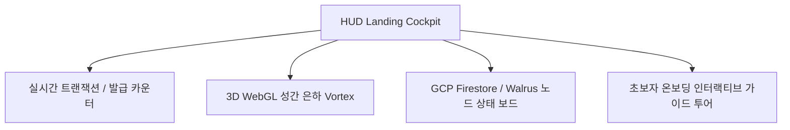

# 📋 Content Passport 프론트엔드 UI/UX 전면 고도화 기획서 (Frontend Upgrade Proposal v2.0)

본 기획서는 **Content Passport** 플랫폼의 사용자 접점이자 브랜드 베이스캠프인 웹 프론트엔드를 고품질 비주얼 디자인과 세련된 마이크로 인터랙션으로 무장하여, 프로덕션 등급에 걸맞은 엔터프라이즈급 UI/UX로 전면 업그레이드하기 위한 청사진입니다.

---

## 1. 개요 및 목적 (Overview & Goals)

현재 Content Passport의 프론트엔드는 다크-네온 사이버네틱 HUD 테마를 차용하여 기본적인 챔버 구조를 구축했으나, 사용자 경험의 심도 있는 완성도를 위해 다음과 같은 핵심 방향성으로 고도화를 진행하고자 합니다.

*   **시각적 극대화 (Visual WOW Factor):** 정적인 카드와 컴포넌트 배치를 넘어, 데이터와 아키텍처 흐름을 역동적으로 시각화하는 인터랙티브 모션 그래픽 적용.
*   **사용자 조작성 보완 (Deep Micro-Interactions):** 블록체인 트랜잭션, 분산 스토리지 봉인, 이미지 포렌식 과정을 사용자가 직관적으로 체감하고 조작할 수 있는 전용 위젯 설계.
*   **백엔드/클라우드 상태 연동 (Live Sync Dashboard):** 백엔드에 새로 도입된 GCP Firestore 및 Vertex AI Sniffer 상태 정보를 실시간으로 피드백 받아 가시화.

---

## 2. 챔버(Chambers)별 세부 업그레이드 상세 기획

### 🪐 Chamber 1. Landing Orbit (Home)
사용자가 플랫폼에 처음 진입하여 시스템 전체 스탯과 상태를 파악하는 허브 대시보드입니다.

*   **3D WebGL 성간 은하 고도화:** 기존 Canvas 2D 방식에서 Three.js 기반의 입체 3D 파티클 은하계로 고도화하여 마우스 드래그 및 호버에 반응하는 성운 피드백을 제공합니다.
*   **실시간 클라우드 모니터링 HUD:** GCP Firestore 연동 로그 및 Walrus 게이트웨이의 가동 시간(Uptime), 평균 레이턴시(ms), Sui Testnet 에포크(Epoch) 진행률을 실시간 차트로 렌더링합니다.
*   **초보자 온보딩 가이드 투어:** 신규 가입자나 해커톤 심사위원을 위해 시스템의 4대 챔버를 순차적으로 안내하는 반투명 가이드 딤드(Dimmed) 레이아웃과 팝업 튜토리얼을 내장합니다.

### 🦁 Chamber 2. Aurelius Forensic Lab (Verify)
업로드된 미디어의 위변조 여부와 메타데이터 신뢰도를 입증하는 정밀 감정 연구실입니다.

*   **ELA 이미지 오버레이 슬라이더 (Image Split Slider):**
    *   **동작:** 원본 이미지와 Forensic Agent가 분석한 JPEG ELA 노이즈 잔차 이미지(ELA residual)를 분할선 슬라이더를 통해 드래그하며 교차 비교할 수 있는 렌더러를 구현합니다.
    *   **효과:** 사용자가 이미지 위를 호버링하여 합성이나 왜곡(Splicing)이 일어난 특정 픽셀 영역을 육안으로 직관적으로 대조해 볼 수 있습니다.
*   **실시간 에이전트 소통 터미널 스트리밍:** ELA 분석 시 백엔드 내부의 4대 에이전트(Forensic, Metadata, Memory, AI Sniffer)가 서로 단서를 공유하고 Verdict(최종 등급)를 도출하는 과정을 나타내는 로그 스트림 콘솔 창을 입체화합니다.
*   **계층형 EXIF/C2PA 트리 뷰어:** 단순 JSON 테이블 대신 C2PA 프로브 데이터와 EXIF 태그들을 접고 펼칠 수 있는 인터랙티브 트리 뷰어로 제공하여 포렌식 증거 가독성을 높입니다.

### 🔐 Chamber 3. Sharded Secret Vault (Vault)
Shamir Secret Sharing 기반의 대칭키 샤딩 및 Walrus 분산 보관을 체험하는 보안 비밀실입니다.

*   **3D 키 궤도 융합 애니메이션 (Key Shard Gravity Collapse):**
    *   **시각화:** 파일 암호화 시 5개의 별자리 모양 키 조각(Shards)이 자물쇠 주위를 회전 궤도로 도는 입체 파티클 모션을 구현합니다.
    *   **동작:** 사용자가 'Reconstruct' 버튼을 누르면 5개 중 선택된 3개의 노드에서 빛 에너지 줄기가 중심으로 수렴하며 닫힌 자물쇠(`🔒`)가 열린 자물쇠(`🔓`)로 트랜지션되는 물리학 모션을 장착합니다.
*   **Walrus 스토리지 셔드 상태 모니터링 그리드:** 사용자의 키 파일이 분산되어 올라간 실제 Walrus 스토리지의 활성 셔드(Shard) 노드 분포 상태를 2D 격자 그리드로 렌더링하여 데이터의 영구성 및 분산 상태를 가시화합니다.

### 🚂 Chamber 4. Co-Creation Economic Simulator (Blueprint)
Move 스마트 계약과 창작자 지분 배분 방식을 이해하고 시뮬레이션하는 공간입니다.

*   **인터랙티브 노드 관계도 편집기 (Interactive Creator Graph):**
    *   **인터페이스:** 수치 입력 슬라이더 대신 SVG/D3.js 기반의 드래그 앤 드롭 노드 차트를 제공합니다.
    *   **조작:** 원본 창작자 노드(Anya)에서 파생된 리믹스 창작자 노드(Ben, Chloe)를 마우스로 연결하고 지분 가중치(Weight)를 노드 크기로 자유롭게 조절할 수 있습니다.
    *   **애니메이션:** 수익이 발생했을 때 지분 가중치 비율에 따라 빛 에너지 볼(Royalty flow particles)이 화살표를 타고 각 지갑 주소로 물리 연동되어 흘러 들어가는 모션을 표현합니다.
*   **Sui PTB Dry Run 터미널:** 블록체인에 `create_and_fund_policy` 트랜잭션을 전송하기 전, 조립된 프로그래머블 트랜잭션 블록(PTB)의 구성 요소를 시각적으로 파싱하여 가스비 소모 한도 및 호출 대상 Move 함수 목록을 검사할 수 있는 디버그 콘솔을 탑재합니다.

### 🧭 Chamber 5. Passport Journey Graph (Journey - Judge Mode)
데이터 수집부터 검증, 온체인 기록 및 분산 저장 보존까지의 전 과정을 타임라인으로 추적하는 최종 관제실입니다.

*   **SVG 인터랙티브 Journey Graph 롤아웃:**
    *   기존의 단순 수직 나열식 목록을 버리고, 원본 이미지 업로드 단계부터 Walrus 및 Sui 계약 발행까지의 6단계 트랙 노드를 유기적 연결망으로 매핑합니다.
    *   단계별 상태가 완료될 때마다 파란색/초록색 맥박(Pulse) 라인이 활성화되며 최종 증거 꾸러미가 포장되는 듯한 동적인 UI 흐름을 설계합니다.
*   **온체인 트랜잭션 영수증 카드 연동:** 각 노드의 검증 증거(Proof) 클릭 시 Suiscan 링크 연동 및 원격 트랜잭션의 Event Payload 파싱 결과를 HUD 스타일 오버레이 팝업으로 투사합니다.

---

## 3. 디자인 시스템 및 심미성 강화 방안 (Aesthetics)

현대적인 웹 디자인 감각과 Cyberpunk HUD 감성이 공존하도록 디자인 시스템을 정밀 튜닝합니다.

*   **유리모피즘 패널 입체화:** `backdrop-filter: blur(25px)` 및 패널 내부에 미세한 노이즈 그레인(Texture grain) 패턴 배경을 은은하게 적용하여 물리적인 반투명 유리 질감을 강화합니다.
*   **다이내믹 컬러 브리딩 (Color Breathing):** 네온 보더라인에 은은한 펄스 애니메이션(`box-shadow` 네온 광원 주기가 부드럽게 깜빡이는 효과)을 가미하여 살아 숨 쉬는 제어 화면의 느낌을 줍니다.
*   **타이포그래피 및 가독성 다듬기:** Fira Code 모노 스페이스 폰트는 터미널/코드 영역에만 집중 배제하고, 사용자 컨텍스트 설명 영역은 `Plus Jakarta Sans` 폰트의 명확한 장평과 명도 조정을 통해 글자 뭉침 현상을 제거합니다.

---

## 4. 성능 최적화 및 롤아웃 로드맵 (Roadmap)

### 4.1 성능 최적화 전략
*   **레이지 로딩 (Lazy Loading) 강화:** Chamber 페이지 단위의 분할 컴포넌트를 유지하여 초기 진입 속도를 단축합니다 ── *[Ref: web/src/App.tsx]*
*   **Canvas 성능 관리:** Canvas 및 Three.js 모듈 기동 시 CPU/GPU 점유율 누수를 막기 위해, 비활성 탭이거나 페이지 이탈 시 반드시 렌더 큐(RequestAnimationFrame)를 해제하고 파괴하는 리소스 가비지 컬렉션을 완벽하게 구현합니다.

### 4.2 단계별 개발 롤아웃 계획 (3단계)

| 단계 | 주요 작업 내용 | 적용 대상 파일 범위 |
| :--- | :--- | :--- |
| **1단계: 디자인 토큰 & HUD 기반 보강** | 글로벌 CSS HSL 컬러 및 글래스모피즘 클래스 최적화 | `web/src/styles.css`, `web/src/App.tsx` |
| **2단계: 챔버 인터랙션 위젯 구현** | 이미지 ELA 슬라이더 오버레이, 3D 키 궤도 융합, SVG 창작 노드 그래프 등 적용 | `web/src/pages/` 하위 전수 페이지 |
| **3단계: 백엔드 상태 바인딩 & Live 테스트** | Firestore 큐 및 Vertex AI Sniffer 응답 실시간 동기화 확인 | `web/src/lib/`, `web/src/pages/Journey.tsx` |

---

## 5. 출처 및 참조 문서 (Citations)

1. **Vite 싱글 페이지 배포 최적화**: Vite 번들링 구성 및 코드 분할 방식에 관한 구조 가이드를 준수합니다.
   * *[Reference Source: docs/architecture-and-deployment.md]*
2. **4대 챔버 및 AASE 포렌식 모델**: JPEG ELA residual, EXIF 메타데이터 감사, Gemini Sniffer 검증 시나리오 흐름을 디자인 아키텍처의 베이스라인으로 활용합니다.
   * *[Reference Source: docs/architecture-and-deployment.md]*
3. **Sui Overflow 2026 심사 규정**: 장기 에이전트 상태 메모리(MemWal) 및 검증 가능한 데이터 접근을 직관적으로 증명할 수 있는 'Judge Mode' Journey Graph 설계를 핵심 평가 영역으로 편입했습니다.
   * *[Reference Source: docs/SuiOverflow2026/walrus-track.md]*
