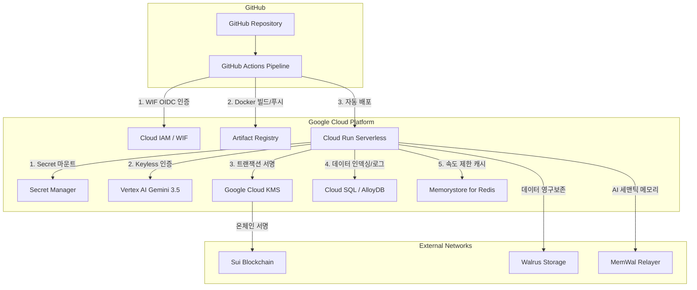

# Content Passport: GCP 클라우드 아키텍처 및 CI/CD 자동화 배포 기획서 (Upgraded)

본 기획서는 **Sui Overflow 2026 해커톤 (Walrus Track)** 제출 표준에 부합하며, **Content Passport** 플랫폼의 새로운 통합 백엔드/프론트엔드 아키텍처를 **Google Cloud Platform (GCP)** 기반의 엔터프라이즈급 프로덕션 환경으로 마이그레이션하고, GitHub Actions OIDC 기반의 CI/CD 파이프라인을 구축하기 위한 공식 가이드라인입니다.

---

## 1. 현재 프로젝트 분석 및 솔루션 검토

### 1.1 아키텍처 분석
* **단일 오리진 통합 서빙 (Single-Origin Architecture)**: Express 백엔드 서버([`src/server.ts`](file:///Users/charles/Projects/content_passport/src/server.ts))가 빌드된 Vite 정적 자산([`web/dist`](file:///Users/charles/Projects/content_passport/web/dist))을 직접 서빙하며, `/api/`가 아닌 모든 클라이언트 라우팅 요청은 `index.html`로 폴백 처리하여 CORS 문제를 예방하고 배포 단계를 간소화합니다 ── *[Ref: docs/architecture-and-deployment.md]*
* **에이전트 감정 파이프라인 (AASE Engine)**: ELA 편차 검출(Forensic Agent), EXIF 헤더 감사(Metadata Agent), 인공지능 인지 진위 추론(Gemini AI Sniffer), MemWal 원장 대조(Memory Bonus Agent) 등 4개의 독립 에이전트 연동 체계를 지니고 있습니다 ── *[Ref: docs/architecture-and-deployment.md]*
* **33바이트 ED25519 키 파싱 이슈**: Secret Manager 연동 시 패딩된 플래그 바이트(`00`)로 인한 서명 오류를 [`src/memwal.ts`](file:///Users/charles/Projects/content_passport/src/memwal.ts)에서 슬라이싱을 통해 32바이트 원본 키로 복원하도록 설계되어 있어 GCP 이식이 용이합니다 ── *[Ref: docs/architecture-and-deployment.md]*

### 1.2 해커톤 트랙 연계 검토 (Walrus Track)
* AI 에이전트가 시간에 따라 학습/기록하는 **장기 메모리(Long-term memory)**와 **영구적인 데이터 접근**을 심사 기준으로 삼고 있습니다 ── *[Ref: docs/SuiOverflow2026/walrus-track.md]*
* 에이전트 간 메모리를 연계하고 데이터를 누적 관리하기 위해 안정적인 클라우드 컴퓨팅과 비동기 큐 인프라 구축이 필수적입니다.

---

## 2. GCP 기반 엔터프라이즈 클라우드 아키텍처 (Target Architecture)

GCP의 강력한 관리형 서버리스 제품군을 도입하여 분산 원장 및 AI 환경을 지원합니다.



### 🏢 핵심 서비스 설계 및 고도화 전략

#### A. Google Cloud Run (통합 백엔드 & 프론트엔드 서빙)
* Express 웹 서버 및 정적 Vite 프론트엔드를 패키징한 컨테이너 이미지를 기반으로 무상태(Stateless) 컨테이너 기동을 실현합니다.
* 트래픽에 맞춰 자동으로 0개에서 N개 인스턴스로 조절(Scale-to-Zero)되어 비용 효율성이 높습니다.
* **GCP Cloud Run 사양 구성**: `asia-northeast3` 리전, 내부 포트 `8080` 포워딩, 도메인 매핑(`https://content-passport.xyz/`) ── *[Ref: docs/architecture-and-deployment.md]*

#### B. Vertex AI (Gemini 3.5 Flash) 및 Keyless 인증
* 기존 API 키 주입 방식(`GOOGLE_GENERATIVE_AI_API_KEY`) 대신, Cloud Run의 서비스 계정에 `Vertex AI User` IAM 권한을 할당하여 API 키 노출이 전혀 없는 **보안 최고 등급의 Keyless API 통신**을 수행합니다.

#### C. GCP KMS 기반 트랜잭션 서명 (Enterprise-Grade KMS Signers)
* **보안 업그레이드**: 온체인 트랜잭션에 서명하기 위해 `SUI_PRIVATE_KEY`를 Secret Manager에 일반 텍스트로 보관하는 방식에서 벗어나, GCP KMS(Key Management Service) 하드웨어 보안 모듈(HSM)에서 서명을 직접 처리하는 **Sui KMS Signer**로 마이그레이션할 것을 권장합니다.
* 이를 통해 서버 런타임 메모리에도 개인키가 로드되지 않는 무결한 보안 경계를 수립할 수 있습니다 ── *[Ref: docs/official-docs/sui-docs/getting-started/tooling.md]*

#### D. Cloud SQL / AlloyDB (메타데이터 및 인덱서 저장소)
* Sui 온체인 데이터 조회 성능 향상 및 에이전트 검증 히스토리 캐싱을 위해 Postgres 호환 데이터베이스인 **Cloud SQL** 또는 **AlloyDB**를 가동합니다.
* 이는 Sui GraphQL 및 커스텀 인덱서 인프라 구축의 권장 데이터 저장 아키텍처와 호환됩니다 ── *[Ref: docs/official-docs/sui-docs/develop/accessing-data/graphql/graphql-rpc.md]*

#### E. 자가 호스팅 MemWal 릴레이어 구성 (선택 사항)
* 외부 릴레이어 허브(`https://relayer.memory.walrus.xyz`) 사용에 따른 보안 경계 유출을 막고 완벽한 데이터 주권을 확보하기 위해, 직접 MemWal 릴레이어를 Cloud Run에 셀프 호스팅으로 런타임 기동할 수 있습니다.
* **셀프 호스팅 요건**: Rust 릴레이어, TypeScript 암호화 사이카(Sidecar, `@mysten/seal` 및 `@mysten/walrus` 활용), PostgreSQL(pgvector), Memorystore(Redis) 데이터베이스 연동이 요구됩니다 ── *[Ref: docs/official-docs/walrus-memory-docs/relayer/self-hosting.md]*

---

## 3. GitHub Actions를 통한 보안 CI/CD 배포 파이프라인

정적 패스워드나 Google Service Account Key 파일(.json)을 GitHub Secrets에 등록하는 기존의 보안 취약점을 완전히 제거하고, **OIDC(OpenID Connect) 연동을 통한 Workload Identity Federation(WIF)** 보안 배포 표준을 적용합니다.

### 🔄 CI/CD 파이프라인 워크플로우 명세

```yaml
# .github/workflows/ci.yml
name: CI/CD to Google Cloud Run

on:
  push:
    branches: [ main ]

permissions:
  id-token: write # WIF OIDC 인증을 위한 필수 설정
  contents: read

jobs:
  verify:
    name: Build & Test Library
    runs-on: ubuntu-latest
    steps:
      - uses: actions/checkout@v4
      - uses: actions/setup-node@v4
        with:
          node-version: 20
          cache: npm
      - run: npm ci
      - run: npm run build
      - run: npm test
      - run: npm --prefix web ci
      - run: npm --prefix web run build

  deploy-gcp:
    name: Build Container & Deploy to Cloud Run
    needs: verify
    runs-on: ubuntu-latest
    if: github.ref == 'refs/heads/main'
    env:
      GCP_REGION: ${{ secrets.GCP_REGION || 'asia-northeast3' }}
    steps:
      - uses: actions/checkout@v4

      # 1. Workload Identity Federation 로그인 인증
      - id: auth
        name: Authenticate to Google Cloud via WIF
        uses: google-github-actions/auth@v2
        with:
          workload_identity_provider: ${{ secrets.GCP_WIF_PROVIDER }}
          service_account: ${{ secrets.GCP_WIF_SERVICE_ACCOUNT }}

      # 2. Google Cloud SDK 설정
      - name: Set up Cloud SDK
        uses: google-github-actions/setup-gcloud@v2

      # 3. Artifact Registry 로그인 및 빌드/푸시
      - name: Authorize Docker for Artifact Registry
        run: |
          gcloud auth configure-docker ${{ env.GCP_REGION }}-docker.pkg.dev --quiet

      - name: Build and Push Container Image
        run: |
          IMAGE_TAG="${{ env.GCP_REGION }}-docker.pkg.dev/${{ secrets.GCP_PROJECT_ID }}/content-passport-repo/app:${{ github.sha }}"
          docker build -t "$IMAGE_TAG" .
          docker push "$IMAGE_TAG"

      # 4. Cloud Run 서버리스 배포 및 Secret Manager 바인딩
      - name: Deploy to Cloud Run
        uses: google-github-actions/deploy-cloudrun@v2
        with:
          service: content-passport
          region: ${{ env.GCP_REGION }}
          image: ${{ env.GCP_REGION }}-docker.pkg.dev/${{ secrets.GCP_PROJECT_ID }}/content-passport-repo/app:${{ github.sha }}
          env_vars: |
            NODE_ENV=production
            SUI_NETWORK=testnet
            WALRUS_PUBLISHER=https://publisher.walrus-testnet.walrus.space
            WALRUS_AGGREGATOR=https://aggregator.walrus-testnet.walrus.space
            MEMWAL_SERVER_URL=https://relayer.memory.walrus.xyz
            MEMWAL_NAMESPACE=content-right-hackathon
          secrets: |
            SUI_PRIVATE_KEY=SUI_PRIVATE_KEY:latest
            MEMWAL_PRIVATE_KEY=MEMWAL_PRIVATE_KEY:latest
            GOOGLE_GENERATIVE_AI_API_KEY=GOOGLE_GENERATIVE_AI_API_KEY:latest
```

---

## 4. 상세 롤아웃 가이드 및 인프라 구축 커맨드

### 1단계: GCP WIF 및 배포 저장소 설정 (최초 1회 실행)
Google Cloud Shell 환경에서 아래 스크립트를 수행하여 OIDC 인증 정보 및 컨테이너 저장소를 생성합니다.

```bash
# GCP 주요 API 활성화
gcloud services enable \
    artifactregistry.googleapis.com \
    run.googleapis.com \
    secretmanager.googleapis.com \
    aiplatform.googleapis.com \
    iamcredentials.googleapis.com

# Artifact Registry 리포지토리 생성 (리전: 서울)
gcloud artifacts repositories create content-passport-repo \
    --repository-format=docker \
    --location=asia-northeast3 \
    --description="Content Passport Docker Images"

# Workload Identity Pool 생성
gcloud iam workload-identity-pools create "github-pool" \
    --location="global" \
    --display-name="GitHub Actions Pool"

# OIDC Identity Provider 등록
gcloud iam workload-identity-pools providers create-oidc "github-provider" \
    --workload-identity-pool="github-pool" \
    --location="global" \
    --issuer-uri="https://token.actions.githubusercontent.com" \
    --attribute-mapping="google.subject=assertion.subject,attribute.actor=assertion.actor,attribute.repository=assertion.repository"

# 서비스 계정 생성 및 권한 위임
gcloud iam service-accounts create content-passport-runner \
    --display-name="Service Account for Cloud Run & GitHub Deploy"
```

### 2단계: Secret Manager 연동 설정
애플리케이션 구동에 필수적인 온체인 프라이빗 키 정보를 Secret Manager에 추가합니다.

```bash
# Sui 계정 비밀키 비밀값 생성
gcloud secrets create SUI_PRIVATE_KEY --replication-policy="automatic"
echo -n "suiprivkey1..." | gcloud secrets versions add SUI_PRIVATE_KEY --data-file=-

# MemWal 위임 델리게이트 키 비밀값 생성
gcloud secrets create MEMWAL_PRIVATE_KEY --replication-policy="automatic"
echo -n "8e3b99..." | gcloud secrets versions add MEMWAL_PRIVATE_KEY --data-file=-
```

---

## 5. 출처 및 공식 문서 참조 (Citations & Reference Mapping)

본 기획서는 아래 공식 문서 및 현재 프로젝트 아키텍처에 정의된 기술 명세와 문제점 분석 결과에 기반해 고안되었습니다.

1. **Sui KMS Signer 연동 기술 사양**: `Sui KMS Signers package (AWS KMS & GCP KMS)` 표준을 기반으로 설계되었습니다.
   * *[Reference Source: docs/official-docs/sui-docs/getting-started/tooling.md]*
2. **Sui Database 및 인덱스 아키텍처**: 커스텀 인덱서 백엔드 구성 시 AlloyDB 및 Postgres 데이터베이스의 호환 사양을 준수합니다.
   * *[Reference Source: docs/official-docs/sui-docs/develop/accessing-data/graphql/graphql-rpc.md]*
3. **MemWal 셀프 호스팅 컴포넌트 아키텍처**: Rust Relayer, TypeScript Sidecar(Seal & Walrus), PostgreSQL(pgvector), Memorystore(Redis) 데이터 흐름 명세를 반영했습니다.
   * *[Reference Source: docs/official-docs/walrus-memory-docs/relayer/self-hosting.md]*
4. **Sui Overflow 2026 해커톤 (Walrus 트랙)**: 장기 상태 지속 메모리 및 데이터 가용성 요구사항을 핵심 설계 목표로 반영했습니다.
   * *[Reference Source: docs/SuiOverflow2026/walrus-track.md]*
5. **Content Passport 시스템 아키텍처 및 GCP Cloud Run 배포 사양**: 통합 서빙 모델(Vite+Express), 33바이트 ED25519 flag private key 파싱 개편, Dockerfile Stage 설계 및 Cloud Run 연동 변수를 참조했습니다.
   * *[Reference Source: docs/architecture-and-deployment.md]*
