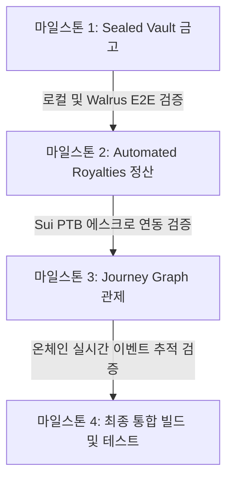

# 📋 Content Passport: 종단간(E2E) 통합 테스트 및 UI/UX 고도화 계획서

본 문서는 **Content Passport** 플랫폼의 사용자 접점인 웹 프론트엔드를 고품질 비주얼과 인터랙션으로 무장하고, React 프론트엔드 - Express 백엔드 - Sui Move 스마트 계약 - Walrus 분산 스토리지 간의 유기적인 **종단간(E2E) 통합 테스트**를 체계적으로 수행하기 위한 개발 및 테스트 로드맵입니다.

---

## 🧭 개요 및 핵심 개발론

우리의 목표는 이미 완성된 기능적 Web3 모듈들을 **심사위원과 사용자에게 직관적으로 증명하는 고해상도 비주얼 경험**으로 전환하는 것입니다. 단순한 입력 폼 대신 암호학적 흐름을 애니메이션 파티클과 SVG 관계 그래프로 시각화합니다.

모든 단계에서 인프라의 안정성을 검증하기 위해 다음 원칙을 준수합니다:
1. **순차적 로컬 개발:** 한 번에 하나의 마일스톤(Chamber)만 집중 개선합니다.
2. **백엔드/온체인 실제 연동 테스트:** 각 단계마다 단순 Mock 상태뿐 아니라 실제 네트워크 훅(Sui Testnet, Walrus 게이트웨이, GCP API)을 결합하여 백엔드 서버와 프론트엔드가 실시간으로 완벽히 통신하는지 검증합니다.
3. **최종 통합 완료 후 일괄 배포:** 모든 기능 개선과 테스트가 성공적으로 종료된 시점에 한꺼번에 커밋 및 배포(Push)를 진행합니다.
4. **비주얼 에셋 및 인터랙션 구현 전략:**
    * **고품질 이미지 에셋:** 디테일과 화질을 확보하기 위해 구글의 최첨단 **Imagen 3** 모델 기반 이미지 생성을 백엔드 및 에셋 파이프라인에 반영합니다. (개발 단계 비용 0원)
    * **실시간 인터랙티브 모션:** 상용 요금이 높고 정적 연출만 가능한 동영상 파일(.mp4) 재생 대신, 브라우저 단에서 사용자의 마우스 움직임에 반응해 흩어지고 수렴하는 **실시간 HTML5 Canvas/CSS3 물리 파티클 애니메이션**을 탑재하여 비용을 절감하고 고난도 프론트엔드 기술력을 증명합니다.

### 💵 GCP 에셋 생성 및 운영 예상 비용 분석

*   **정적 이미지 생성 (Vertex AI Imagen 3):**
    *   단가: 이미지 1장당 약 `$0.03` (Imagen 3 Fast 기준)
    *   소요 예측: 각 마일스톤별 핵심 에셋(보안 엠블럼, 에스크로 스탬프, 신뢰 배지 등) 총 5~6장 생성.
    *   예상 총 비용: 약 **`$0.15 ~ $0.18`** (매우 미미하며, 개발 단계에서는 Antigravity 로컬 툴 및 GCP Free Tier 내에서 소화하여 실질 비용 `$0.00`)
*   **동영상 콘텐츠 생성 (Vertex AI Video Generator):**
    *   단가: 5초 비디오 클립 생성당 약 `$1.00` 수준으로 지속적인 테스트 시 비용 부담 발생 우려.
    *   **대체 전략:** 브라우저 네이티브 HTML5 Canvas 및 CSS3 Keyframes 물리 파티클 코드로 100% 자체 구현.
    *   예상 총 비용: **`$0.00`** (비용 절감뿐만 아니라, 정적 비디오와 달리 사용자의 클릭/마우스 무브에 실시간 반응하는 60fps 인터랙션 획득)
*   **호스팅 및 빌드 파이프라인 (Cloud Run / Artifact Registry):**
    *   GCP Cloud Run Free Tier(월 200만 회 호출, CPU 18만 초 무료) 및 Artifact Registry 무료 용량 이내에서 소화 가능.
    *   예상 총 비용: **`$0.00`**

---

## 🛠️ 마일스톤별 UI 고도화 및 통합 테스트 계획

### 🛰️ 마일스톤 1: Sealed Vault (비밀 금고 3D 시각화 및 Walrus 연동)
Shamir Secret Sharing (3/5) 암호 키 분산 기법을 사용자가 직관적으로 체감할 수 있도록 **Sealed Vault (Chamber II)**를 업그레이드합니다.

#### 1. UI/UX 고도화 스펙
*   **3D Shard Particle Orbit Canvas (암호 조각 궤도 융합 애니메이션):**
    *   *암호화 흐름:* 사용자가 파일을 드롭하는 순간, 문서 아이콘이 **5개의 입체적인 네온 파티클 조각(Shards)**으로 쪼개져 화면상에 궤도를 그리며 외곽의 5대 수호자(Node)로 날아가는 물리 모션을 장착합니다.
    *   *복호화 흐름:* 사용자가 '복호화 키 요청' 버튼을 누르면, 5개 노드 중 선택된 3개의 노드($k=3$)로부터 밝은 에너지 줄기가 중심으로 수렴하며 하나의 마스터 복호화 키로 융합되어 자물쇠가 열리는 트랜지션 애니메이션을 구현합니다.
*   **Walrus 스토리지 셔드 상태 모니터링 그리드:**
    *   현재의 텍스트 리스트를 독일, 싱가포르, 미국, 일본, 아일랜드 등 5개 글로벌 스토리지 노드의 연결 지연 시간(Latency)과 가동 상태를 보여주는 **미래지향적 2D 격자 모니터판**으로 리팩토링합니다.

#### 2. 비주얼 에셋 생성 및 배치 (Visual Asset Generation)
*   **보안 자물쇠/엠블럼 이미지 생성:** 이미지 생성 AI(`generate_image` 등)를 활용하여 미래지향적인 **'디지털 봉인 보안 실(Security Seal/Emblem)'** 혹은 **'크립토 자물쇠 그래픽'** 에셋을 생성하고, 금고 업로드 대기 영역 및 락 장치 카드 배경에 적용하여 심미적 완성도를 극대화합니다.
*   **비주얼 로드맵:** 로컬 스토리지에 저장되는 셔드 분배 데이터를 사용자가 즉각 이해할 수 있도록 구조 도식화 이미지를 팝업 형태로 삽입합니다.

#### 3. 종단간(E2E) 통합 테스트 프로토콜
*   **로컬 암호화 검증:** 파일 업로드 시 브라우저 내부에서 AES-256 대칭키가 5개의 독립된 암호화 셔드로 정상 쪼개지고 저장되는지 브라우저 로컬 스토리지 상태를 모니터링합니다.
*   **Walrus 게이트웨이 전송 검증:** 암호화된 파일 바이너리 페이로드가 Express 백엔드로 전송되어 버퍼 캐싱된 뒤, Walrus Publisher Gateway를 거쳐 분산 업로드되고 고유한 Walrus Blob ID를 반환받는지 확인합니다.
*   **임계값(Threshold) 복호화 오류 테스트:**
    *   1~2개 노드 서명 승인 시: 복호화 실패 로그 출력 및 `Threshold Criteria Not Met (2/3)` 경고 화면 표시 유무 확인.
    *   3개 이상 노드 서명 승인 시: 브라우저 내부에서 복호화 키가 복구되어 원본 파일 버퍼가 복원되는지 확인.

---

### 💰 마일스톤 2: Automated Royalties (실시간 정산 및 Sui PTB 연동)
정적인 입력 슬라이더 형태를 넘어서, 기여자 간의 수익 분배 비율을 SVG 노드 맵을 통해 조작하고 정산하는 **Automated Royalties (Chamber III)**를 구축합니다.

#### 1. UI/UX 고도화 스펙
*   **Interactive Creator Stream Graph (실시간 로열티 흐름 관계망):**
    *   SVG/Canvas 기반으로 Anya(원작자), Ben/Chloe(리믹스 참여자)를 유기적으로 잇는 노드 맵을 구현합니다.
    *   각 참가자의 기여도(지분율) 슬라이더를 움직이면 **노드 간 흐름 연결선(스트림)의 굵기가 실시간으로 굵어지거나 가늘어지도록** 설계합니다.
    *   로열티 배분 실행 시, 구매자 노드로부터 빛나는 디지털 동전(파티클)들이 설정 비율에 맞춰 정확히 쪼개져 각 크리에이터 주소로 분사되어 빨려 들어가는 흐름 애니메이션을 장착합니다.
*   **Sui PTB Dry Run Terminal:**
    *   트랜잭션을 블록체인에 전송하기 전, 조립된 프로그래머블 트랜잭션 블록(PTB)의 구성 요소를 시각적으로 파싱하여 가스비 소모 한도 및 호출 대상 Move 함수 목록을 검사할 수 있는 디버그 콘솔을 탑재합니다.

#### 2. 비주얼 에셋 생성 및 배치 (Visual Asset Generation)
*   **에스크로 씰/분배 스탬프 이미지 생성:** AI 이미지 생성을 활용해 **'온체인 기여 계약 증인 스탬프 (Sui Move Escrow Verification Stamp)'** 고해상도 그래픽을 생성하여, 스마트 계약이 활성화되고 자금이 락업되는 정책 수립 카드의 중앙 우측에 배치하여 프로덕션 등급의 정합성을 표현합니다.
*   **비주얼 로드맵:** 로열티 배분 흐름 시뮬레이션을 설명하는 간결하고 세련된 기여자 도식 이미지를 우측 패널에 투사합니다.

#### 3. 종단간(E2E) 통합 테스트 프로토콜
*   **에스크로 계약 생성 검증:** 지갑을 연결한 상태에서 실제 Sui Testnet 상에 `create_and_fund_policy` 트랜잭션을 전송하여 정상적인 `CoCreationPolicy` 스마트 계약 오브젝트가 생성되고 자금이 예치되는지 검증합니다.
*   **Atomic Split 분배 검증:**
    *   생성된 에스크로 계약 오브젝트에 대해 `distribute_royalties`를 호출합니다.
    *   Sui RPC를 통해 트랜잭션 수행 결과를 받아와, 단 한 번의 트랜잭션 내부에서 가중치 배분 지분만큼 정밀하게 split되어 각 크리에이터 지갑 주소로 잔액이 즉시 전송되었는지 트랜잭션 이벤트를 분석합니다.

---

### 🧭 마일스톤 3: Journey Graph 관제 (최종 판사 모드 활성화)
단순 수직 리스크 형태였던 **Journey Graph (Judge Mode)**를 전체 검증 여정을 실시간으로 추적하는 인터랙티브 관제 시스템으로 탈바꿈합니다.

#### 1. UI/UX 고도화 스펙
*   **SVG 인터랙티브 Journey Graph 맵:**
    *   스마트 계약 배포와 증거 보존(1. 검증 ➔ 2. 아카이브 ➔ 3. 영구 기억 ➔ 4. 여권 발급 ➔ 5. 정책 생성 ➔ 6. 정산 완료)으로 이어지는 6개 트랙 노드를 연결하는 연결망 맵을 렌더링합니다.
    *   이전 증거들이 확보되어 각 단계가 완료(Ready)될 때마다 노드와 노드 사이의 선을 타고 **초록색/네온블루 광선 펄스(Pulse)**가 흐르며 다음 노드를 활성화하는 동적 이벤트를 추가합니다.
*   **Proof Inspector (증거 상세 검사기) 패널:**
    *   각 연결 노드를 클릭하면 해당 시점에 기록되었던 메타데이터 해시, Walrus Blob 스펙, 또는 Sui 트랜잭션 해시를 HUD 모니터 느낌의 반투명 팝업으로 상세 투사합니다.

#### 2. 비주얼 에셋 생성 및 배치 (Visual Asset Generation)
*   **검증 필증/신뢰 배지 이미지 생성:** AI 이미지 생성 도구를 활용하여 공인된 Provenance 및 진위 증명을 나타내는 **'신뢰 배지/인증 필증 마크 (Sovereign Trust Badge)'**를 고해상도로 생성해, 여정 맵의 최종 종착지인 6단계(정산 및 아카이브 검증 완료) 노드 근처 및 상세 팝업의 인증 마크 영역에 배치합니다.
*   **비주얼 로드맵:** 각 6개의 관제망 노드 상징 아이콘들을 세련된 커스텀 네온 글래픽 마크로 교체하여 인터랙티브 완성도를 높입니다.

#### 3. 종단간(E2E) 통합 테스트 프로토콜
*   **로컬 상태값 복원 체크:**
    *   사용자가 이전 화면들에서 진행했던 검증 이력, 여권 발급 이력, 에스크로 정책 이력들이 로컬 스토리지 캐시를 통해 정확히 유추되어 초기 노드 맵 상태에 반영되는지 검증합니다.
*   **실시간 온체인 이벤트 추적:**
    *   Sui 트랜잭션 노드들의 경우, 단순히 로컬 플래그 상태만 보는 것이 아니라 Sui Testnet API(JSON-RPC)를 호출하여 트랜잭션 다이제스트의 실시간 검증을 진행합니다.
    *   오브젝트 변경 사항 중 `IssuePassportEvent`, `RoyaltyPaidEvent`와 같이 스마트 계약이 내뿜는 실제 이벤트 로그를 파싱하여 검증이 완료되었을 때만 노드 상태를 `Ready`로 전환하는지 통합 테스트를 수행합니다.

---

## 📈 E2E 통합 테스트 일정 및 완료 기준

모든 작업을 마친 후 로컬에서 최종 배포 준비가 되었는지는 다음의 체크리스트를 기준으로 판정합니다.

| 단계 | 대상 챔버 | 연동 테스트 항목 | 검증 방법 |
| :--- | :--- | :--- | :--- |
| **마일스톤 1** | `Vault.tsx` (비밀 금고) | 로컬 파일 암호화 + Shamir 조각 생성 + Walrus 업로드 | 복호화 성공 여부 및 Walrus 게이트웨이의 Blob 데이터 실시간 확인 |
| **마일스톤 2** | `Blueprint.tsx` (기여도 분배) | 에스크로 PTB 생성 및 실제 Sui Testnet 정산 트랜잭션 수행 | Sui RPC Response 상의 오브젝트 상태값 및 분배 주소 잔고 확인 |
| **마일스톤 3** | `Journey.tsx` (관제 맵) | 온체인 RPC 연동 실시간 이벤트 수집 및 증거 매칭 | Suiscan 탐색기 연동 및 디버그 콘솔의 RPC 로그 확인 |
| **마일스톤 4** | 전체 공통 | 전체 프로젝트 TypeScript 컴파일 빌드 및 단위 테스트 통과 | 로컬 터미널에서 `npm run build` 및 `npm test` 성공 여부 확인 |

---

## 🤝 사용자 동의

본 기획서 내용을 검토해 보신 후, 동의하신다면 **`Proceed`** 단추를 눌러주시거나 피드백을 전달해 주세요. 곧바로 로컬 작업 공간에서 **`마일스톤 1: Sealed Vault (3D 파티클 금고 및 노드 그리드)`** 고도화 구현에 착수하겠습니다. (모든 결과물은 완성될 때까지 로컬에만 보관됩니다.)
