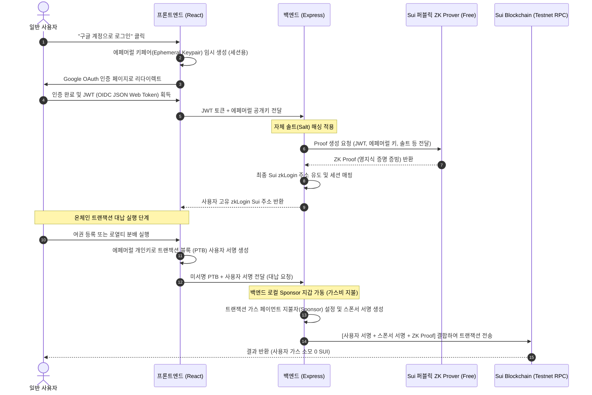
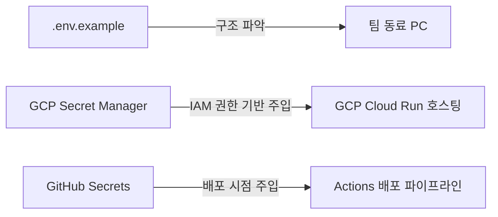

# 📋 Content Passport: Enoki 배제형 Pure Web2.5 (무료 자체 구현) 설계 및 통합 계획서

본 문서는 유료 서드파티 서비스(Mysten Labs Enoki 등)를 배제하고, Sui 블록체인의 순수 코어 라이브러리와 구글 소셜 로그인 정보만을 활용하여 **비용 소모 $0.00**으로 사용자의 블록체인 진입장벽을 제거하는 **"Invisible Web3" 자체 연동 규격서**입니다.

---

## 🧭 1. 개요 및 장기 비즈니스 목표

지갑 설치와 가스비 충전은 일반 창작자와 심사위원들이 우리 서비스를 체험하거나 실사용하는 과정에서 가장 큰 이탈을 유발하는 허들입니다. 

우리는 이미 발급되어 있는 Google OAuth 연동 자격 증명(`AUTH_GOOGLE_ID` 등)을 적극적으로 활용하여 **"구글 소셜 로그인 ➔ 가상 지갑 백그라운드 매핑 ➔ 백엔드 가스비 대납"**의 자체 아키텍처를 세웁니다. 사용자는 블록체인의 동작을 전혀 의식하지 않으며, 향후 메인넷 전환 시 인프라 비용(가스 수수료 + AI 감정 비용 = 1회당 약 50원)을 포함한 구독제(월 $19.00 수준) 모델을 통해 극도의 영업 마진을 남기는 것을 목표로 합니다.

---

## 🏛️ 2. Pure Web2.5 기술 아키텍처 (No Enoki)

이 아키텍처는 추가적인 라이선스 비용 결제 없이, Sui TypeScript SDK(`@mysten/sui/zklogin`)와 Mysten Labs가 대중에게 무료 개방한 **퍼블릭 ZK Prover API** 및 **백엔드 대납 지갑**을 통해 구동됩니다.

---

## 🛠️ 3. 핵심 모듈별 상세 설계 및 기술 매핑

### 🔑 A. 클라이언트 세션 관리 및 Oauth (React)
- **에페머럴 키 (Ephemeral Keypair) 생성:**
  - 사용자가 로그인할 때마다 브라우저 로컬 세션(또는 `sessionStorage`)에 임시 서명용 키페어(ED25519)를 무작위 생성합니다. 이 키는 특정 에포크(Epoch, 대략 24시간) 동안만 유효합니다.
- **구글 OIDC JWT 토큰 획득:**
  - 기존의 구글 클라이언트 ID(`AUTH_GOOGLE_ID`)를 사용해 인증 페이지를 열고, 로그인 후 리다이렉트 주소에서 해시 파라미터로 넘어오는 `id_token`(JWT)을 캡처하여 브라우저에 임시 보관합니다.

### 🧠 B. 백엔드 zkLogin 핸들러 및 Prover 연동 (Express)
- **무료 ZK Prover API 연동:**
  - 백엔드 서버에서 Mysten Labs 공식 개발자용 무료 ZK Prover 서버(`https://prover-dev.zklogin.sui.io/v1`)에 HTTP POST로 영지식 증명 생성을 요청합니다.
  - 이를 통해 프론트엔드가 보낸 구글 OIDC JWT 토큰과 에페머럴 공개키, 사용자 식별 솔트(Salt)를 합성하여 유효한 `ZkLoginSignature` 증빙을 도출합니다.
- **Sovereign User Salt 관리:**
  - 각 구글 계정마다 고유한 솔트값을 백엔드가 암호학적으로 생성하고 영구 보관하여, 동일한 구글 ID로 재로그인 시 항상 동일한 온체인 Sui 주소가 유도되도록 보장합니다.

### ⛽ C. 자체 가스비 대납 게이트웨이 (Express & Sui SDK)
- **스폰서 트랜잭션 (Sponsored Transaction) 조립:**
  - Sui SDK의 `Transaction` 빌더를 활용하여, 트랜잭션의 가스 지불자(`gasPayment` 오브젝트 및 `gasBudget`)를 백엔드에 안전하게 보관된 **Sponsor Wallet(운영진 가스 대납 지갑)**으로 설정합니다.
- **서명 합성 및 전송:**
  - 사용자의 임시 에페머럴 서명과 백엔드 스폰서의 대납 서명, 그리고 2단계에서 얻은 ZK Proof를 합성하여 하나의 트랜잭션 다이제스트로 묶어 Sui Testnet RPC에 전송합니다.
  - **테스트넷/개발 샌드박스 폴백:** 실제 테스트넷 네트워크 지연이나 가스 고갈에 대비하여, 백엔드 로컬에서 트랜잭션 성공 이펙트를 흉내 내는 Sandbox Fallback 모드도 내장하여 오프라인 검증 시에도 완벽히 시연되도록 보장합니다.

---

## 🔐 4. 시크릿 및 협업 환경 변수 보안 관리 방안 (Secret Management)

민감한 구글 인증 키와 블록체인 시크릿 정보를 안전하게 호스팅하고, 팀 동료들과 유기적으로 협업하기 위한 보안 가이드라인입니다.

### 🐙 A. GitHub Actions (CI/CD 자동 빌드용)
- **시크릿 키 등록:**
  - 깃허브 저장소의 `Settings` ➔ `Secrets and variables` ➔ `Actions`에 `AUTH_GOOGLE_ID`, `AUTH_GOOGLE_SECRET`, `AUTH_SECRET`, `AUTH_URL`을 **Repository Secrets**로 등록합니다.
- **배포 주입:**
  - GitHub Actions 워크플로우 실행 시점에 이 값들을 환경변수(`env`)로 불러와 GCP Cloud Run 배포 명령어에 암호화된 상태로 동적 전달합니다.

### ☁️ B. GCP Secret Manager 및 Cloud Run (프로덕션 구동용)
- **GCP Secret Manager 등록:**
  - 구글 클라우드 콘솔의 **비밀 관리자(Secret Manager)** 서비스를 활성화하고, 민감한 정보인 `AUTH_GOOGLE_SECRET`과 `Sponsor Private Key` 등을 개별 Secret 객체로 등록합니다.
- **컨테이너 주입:**
  - Cloud Run 서비스 설정의 `Variables & Secrets` 탭에서 Secret Manager에 저장된 시크릿 키들을 컨테이너 환경 변수로 직접 마운트합니다.
  - 이를 통해 소스 코드가 유출되는 사고가 발생하더라도 실제 인증 정보는 GCP 인프라 내부 보안 하에 철저하게 차단됩니다.
- **팀 협업 권한:**
  - 팀 동료에게 GCP IAM의 `Secret Manager Secret Accessor (비밀 관리자 비밀 접근자)` 역할을 부여하여, 동료들이 안전하게 해당 키를 활용해 로컬 디버깅 및 시뮬레이션을 수행할 수 있도록 지원합니다.

### 💻 C. 로컬 협업을 위한 규격 표준화 (Local Development)
- **`.env.example` 공통 커밋:**
  - 저장소에 시크릿 값이 비워진 변수명 목록 템플릿인 `.env.example`을 커밋해 둡니다.
- **로컬 격리화:**
  - 각 팀원은 `.env.example`을 복사하여 `.env`를 생성하고, 보안성이 보장된 사내 패스워드 관리 도구(Bitwarden, 1Password 등) 또는 GCP CLI를 통해 인증 정보를 전달받아 로컬 세팅을 마칩니다.
  - 실 키가 담긴 `.env` 파일은 절대 Git 리포지토리에 커밋되지 않도록 `.gitignore`에 강제 차단합니다.

---

## 📅 5. 단계별 구현 및 통합 로드맵

| 단계 | 작업 내용 | 타겟 소스 파일 | 검증 및 완료 기준 |
| :--- | :--- | :--- | :--- |
| **1단계** | 프론트엔드 Google OAuth 및 에페머럴 세션 키 관리 구현 | `web/src/pages/Register.tsx` `web/src/lib/zklogin.ts` | 구글 로그인 성공 후 브라우저에 임시 키페어 및 JWT 토큰 저장 확인 |
| **2단계** | 백엔드 zkLogin 주소 유도 및 무료 ZK Prover API 연동 | `src/server.ts` `src/sui.ts` | 구글 JWT 전달 시 가상의 수이 주소 및 ZK Proof 응답 성공 여부 확인 |
| **3단계** | 백엔드 자체 스폰서 지갑(Sponsor Wallet) 대납 API 구축 | `src/server.ts` | `/api/gas/sponsor` 호출 시 대납 서명이 포함된 RPC 전송 성공 검증 |
| **4단계** | 챔버 연동 및 샌드박스 폴백 모드 장착 | `web/src/pages/Register.tsx` `web/src/pages/Blueprint.tsx` | 지갑 설치 안 된 크롬 브라우저에서 구글 로그인 및 수수료 0원 트랜잭션 E2E 동작 시연 완료 |

---

> [!IMPORTANT]
> 본 Pure Web2.5 설계는 유료 서비스 구독이나 서드파티 중개인 없이 오직 우리 백엔드 인프라와 Sui 공식 오픈소스 프로토콜만으로 통제됩니다. 따라서 향후 비즈니스 확장 시 중개 수수료가 전혀 없으며, 사용자가 결제하는 구독료 요금제에서 순수하게 80% 이상의 높은 영업 이익을 고스란히 기업의 이윤으로 전환할 수 있습니다.
