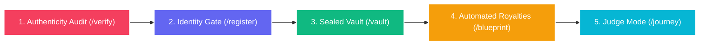

# Release Notes - v0.9.5
**Release Date:** June 30, 2026  
**Tag:** `v0.9.5`  
**Deploy Endpoint:** `https://content-passport.xyz/`  
**Network:** Sui Testnet (Package: `0xac28432a557d52d7079930a82a5c1732a3709da3c6cb2991ce0332b0704061da`)

---

## 🌌 Project Vision & Philosophy

**Content Passport** is a sovereign digital identity and verifiable provenance ecosystem for human creators and autonomous AI agents. Built at the intersection of **Sui Layer-1 blockchain speed**, **Walrus sharded storage cost-efficiency**, and **Shamir cryptographic secret sharing**, Content Passport guarantees:
1. **Verifiable Provenance**: On-chain verification of media origin via multi-agent pixel and EXIF forensics.
2. **Absolute Privacy**: Raw masterpieces are encrypted and sharded in the browser. The host server never acquires plaintext access.
3. **Equitable Split Economy**: Auto-funded escrows distribute remix royalties directly to co-creators.

---

## 🗺️ The E2E User Pipeline (5 Chambers)

The user journey is structured into 5 interactive chambers:

### 1. 🔍 Authenticity Audit (`/verify`)
- **Action**: Creators drop their digital masterworks (images, audio, files).
- **Core Technology**:
  - **Error Level Analysis (ELA)**: Re-saves images at a known compression level (95%) and extracts pixel residuals to detect micro-manipulation.
  - **EXIF & C2PA Prov-Parser**: Examines camera models, lens params, software stamps, and C2PA cryptographic signature manifests.
  - **Gemini 3.5 Flash Vision Sniffer**: Evaluates optical anomalies, neural textures, lighting inconsistencies, and style prompt profiles.
  - **MemWal Memory Matching**: Compares the media's DCT pHash against a fast-lookup database of previously certified works to prevent replicas.
- **Output**: Generates an **AASE (Agentic Authenticity Score)** and assigns a certified letter grade (AAA, AA, A, B, C, F).

### 2. 🔑 Identity Gate (`/register`)
- **Action**: Creators map their real-world identities to decentralized accounts.
- **Core Technology**:
  - **Google OIDC zkLogin**: Employs OAuth identity tokens to construct ephemeral browser key pairs.
  - **Mysten Labs Enoki Integration**: Derives zkLogin address seeds and requests zero-knowledge proofs keylessly.
  - **Gasless NFT Minting**: Builds a sponsored transaction block (PTB) to mint a sovereign **Genesis Creator Passport NFT** on-chain with zero gas fees.

### 3. 🔐 Sealed Vault (`/vault`)
- **Action**: Creators lock up raw masterpiece payloads securely.
- **Core Technology**:
  - **Browser-Side AES-256-GCM**: Symmetric encryption of binaries occurs locally inside browser memory.
  - **Shamir's Secret Sharing (3/5)**: The 256-bit symmetric key is split into 5 distinct threshold shards.
  - **Walrus Decentralized Blobs**: Ciphertext payloads are uploaded to Walrus storage nodes.
  - **Lagrange Interpolation Handshake**: To retrieve the file, creators select any 3 of the 5 guardian nodes to reconstruct the symmetric key and decrypt.
- **v0.9.5 Enhancement**: Added a self-healing fallback that downloads custom specimen files directly from Walrus if the browser's React state was wiped by the OIDC redirect.

### 4. 🔀 Automated Royalties (`/blueprint`)
- **Action**: Creates a co-creation treaty for remix works.
- **Core Technology**:
  - **Move CoCreation Policies**: Deploys on-chain royalty structures with custom weights.
  - **Funded Escrows**: Allocates sales revenues atomically to all registered passport holders.

### 5. ⚖️ Judge Mode (`/journey`)
- **Action**: Audits the entire lifecycle of any passport.
- **Core Technology**:
  - **Interactive Journey Graph**: Verifies all 6 on-chain milestones.
  - **Artifact Log**: Inspects proof digests, EXIF metadata, AASE scores, and Walrus blob links.

---

## 📦 Codebase Architecture

The project is organized as a monorepo containing three primary layers:

### 1. Smart Contracts (`contracts/`)
Written in **Sui Move** to ensure high-speed, parallelized execution of identity and asset logic:
- `sources/genesis_passport.move`: Issues non-transferable creator passports containing media hashes and authenticity grades.
- `sources/seal_policy.move`: Defines threshold-signature constraints and key-node authorizations for encrypted vaults.
- `sources/co_creation_policy.move`: Manages co-creation percentages and handles escrow split payouts automatically.

### 2. Core Server & SDK (`src/`)
Written in **TypeScript (Node.js/Express)** and deployed serverlessly:
- `aase.ts`: Implements the multi-agent authenticity weighting score algorithm.
- `agents.ts`: Coordinates AI Vision sniffing and pixel/header analysis.
- `evidence.ts`: Manages Shamir Secret Sharing mathematics over $GF(256)$ fields.
- `server.ts`: Powers SSE (Server-Sent Events) streaming APIs, Enoki gas builders, and static SPA routing.
- `zklogin-salt.ts`: Safeguards user privacy via salted user address derivation.

### 3. SPA Client (`web/`)
A premium, dark-themed, glassmorphic UI built using **React + Vite + Vanilla CSS**:
- Interactive canvas particle system representing web of trust node shards.
- ELA pixel analysis split-view sliders.
- Holographic 3D passport cards utilizing CSS transforms.

---

## 🛠️ Release Changelog (v0.9.5)

| Component | Scope | Update Details |
|-----------|-------|----------------|
| **Frontend** | `web/src/pages/Vault.tsx` | Fixed automatic recovery of custom files. If state is lost due to zkLogin redirect, the app downloads the original media from the Walrus gateway using localStorage references. |
| **Frontend** | `web/src/pages/Vault.tsx` | Added graceful warning logs (`[WARNING] ...`) in the UI console to prevent silent idle states if files are lost. |
| **Configs** | `package.json`, `web/package.json` | Bumped versions to `0.9.5`. |
| **Documentation** | `README.md` | Updated release notes directory version range references to cover `v0.9.5`. |
